# Diagrama de Clases — DDM

Diagrama de clases minimalista de todo el backend `DDM` (`src/controller`, `src/model`, `src/view`), en Mermaid (se renderiza nativamente en GitHub y GitLab).

## Criterio de simplificación

El código real tiene **17 subclases concretas de `ICommand`** (patrón Command de la CLI de testing) y **8 subclases de `QEK`** (una por tipo de overlay). Graficar cada una sería ruido, así que se muestran 2-3 representativas por jerarquía + una `note` con el resto. Se omiten getters/setters triviales y parámetros completos de firmas; se conservan constructores, métodos virtuales y atributos que expresan una relación (composición/agregación/dependencia) entre clases.

Se detectaron **dos pipelines de comandos paralelos** que conviven en el código:

1. **CLI de testing** (`controller/commands/` + `CommandRegistry` + `CommandDispatcher`, disparada por `view/StdinReader`): una clase `ICommand` por comando.
2. **Pipeline real del frontend** (`controller/json/JsonCommandHandler` + 4 `XxxCommandHandler`): un método por comando JSON (`create_line`, `create_track`, etc.), sin una clase por comando.

Ambos pipelines convergen en las mismas clases de `controller/services/` y en el mismo `CommandContext` (el "hub" de estado del backend: colecciones de `Track`, `CursorEntity`, `AreaEntity`, `CircleEntity`, `PolygonoEntity`, estado de ownship/CPA/estacionamiento y el `ITransport*` de salida).

---

```mermaid
classDiagram
    %% ==================== CONTROLLER — Pipeline CLI (Command pattern) ====================
    class ICommand {
        <<interface>>
        +getName() QString
        +getDescription() QString
        +usage() QString
        +execute(CommandInvocation, CommandContext) CommandResult
    }
    class AddCommand
    class DeleteCommand
    class ListCommand
    class CpaCommand
    class EstacionamientoCommand

    ICommand <|-- AddCommand
    ICommand <|-- DeleteCommand
    ICommand <|-- ListCommand
    ICommand <|-- CpaCommand
    ICommand <|-- EstacionamientoCommand
    note for ICommand "17 subclases concretas en total.<br/>No graficadas: AddCursorCommand, DeleteCursorsCommand,<br/>ListCursorsCommand, AddAreaCommand, DeleteAreaCommand,<br/>AddCircleCommand, DeleteCircleCommand, AddPolygonoCommand,<br/>OwnShipCommand, CenterCommand, SitrepCommand, DisplayModeCommand"

    class CommandRegistry {
        -commands
    }
    class CommandDispatcher {
        +dispatch(CommandInvocation) CommandResult
    }
    CommandRegistry o-- ICommand : QSharedPointer
    CommandDispatcher --> CommandRegistry
    CommandDispatcher ..> CommandContext

    class CPA {
        +computeCPA()
    }
    CpaCommand ..> CPA : motor de cálculo, no es un ICommand

    %% ==================== CONTROLLER — Pipeline JSON (frontend real) ====================
    class JsonCommandHandler {
        -m_commandMap
        +handle(QJsonObject) QByteArray
        +initializeCommandMap()
    }
    class CursorCommandHandler {
        +createLine(QJsonObject) QByteArray
        +deleteLine(QJsonObject) QByteArray
        +listLines(QJsonObject) QByteArray
    }
    class GeometryCommandHandler {
        +createArea/createCircle/createPolygon() QByteArray
        +deleteArea/deleteCircle/deletePolygon() QByteArray
        +listShapes(QJsonObject) QByteArray
    }
    class TrackCommandHandler {
        +createTrack(QJsonObject) QByteArray
        +deleteTrack(QJsonObject) QByteArray
        +listTracks(QJsonObject) QByteArray
    }
    class OwnShipCommandHandler {
        +updateOwnShip(QJsonObject) QByteArray
    }

    JsonCommandHandler *-- CursorCommandHandler
    JsonCommandHandler *-- GeometryCommandHandler
    JsonCommandHandler *-- TrackCommandHandler
    JsonCommandHandler *-- OwnShipCommandHandler
    JsonCommandHandler *-- CPAService
    JsonCommandHandler *-- EstacionamientoService

    class JsonValidator {
        <<utility>>
        +validateNumericField()$
        +validateIntegerField()$
        +validateStringField()$
    }
    class JsonResponseBuilder {
        <<utility>>
        +buildSuccessResponse()$
        +buildErrorResponse()$
    }
    class JsonSerializer {
        <<utility>>
        +serialize(CursorEntity)$ QJsonObject
    }
    CursorCommandHandler ..> JsonValidator
    CursorCommandHandler ..> JsonResponseBuilder
    GeometryCommandHandler ..> JsonValidator
    GeometryCommandHandler ..> JsonResponseBuilder

    %% ==================== CONTROLLER — Services (capa de dominio compartida) ====================
    class TrackService
    class CursorService
    class GeometryService
    class OwnShipService
    class CPAService
    class TrackPppService
    class EstacionamientoService
    class SitrepService
    class QueryService
    class CenterService
    class ObmService

    CursorCommandHandler *-- CursorService
    GeometryCommandHandler *-- GeometryService
    TrackCommandHandler *-- TrackService
    OwnShipCommandHandler *-- OwnShipService
    AddCommand ..> TrackService
    DeleteCommand ..> TrackService
    ListCommand ..> TrackService

    class PppCalculator
    class EstacionamientoCalculator

    TrackService --> TrackPppService
    OwnShipService --> TrackPppService
    CPAService ..> PppCalculator
    EstacionamientoService ..> EstacionamientoCalculator
    ObmService --> IOBMHandler

    %% ==================== MODEL — CommandContext (hub de estado) ====================
    class CommandContext {
        +deque~Track~ tracks
        +deque~CursorEntity~ cursors
        +deque~AreaEntity~ areas
        +deque~CircleEntity~ circles
        +deque~PolygonoEntity~ polygons
        +OwnShipState ownShip
        +deque~CpaMarkerState~ cpaMarkers
        +stationingSessions
        +MotionMode motionMode
        +ITransport* transport
    }
    CommandContext o-- Track
    CommandContext o-- CursorEntity
    CommandContext o-- AreaEntity
    CommandContext o-- CircleEntity
    CommandContext o-- PolygonoEntity
    CommandContext --> ITransport : envía eventos JSON

    %% ==================== MODEL — Entities ====================
    class Track {
        +int id
        +TrackData::Type type
        +TrackData::Identity identity
        +TrackData::TrackMode mode
        +double x
        +double y
    }
    class CursorEntity {
        +int cursorId
        +double x
        +double y
        +double angulo
        +double largo
        +int lineType
    }
    class AreaEntity {
        +QPointF A,B,C,D
        +int cursorIdAB,BC,CD,DA
        +calculateAndStoreCursors(CommandContext)
    }
    class CircleEntity {
        +QPointF center
        +double radius
        +vector~int~ cursorIds
    }
    class PolygonoEntity {
        +vector~QPointF~ points
        +vector~int~ cursorIds
    }
    AreaEntity ..> CursorEntity : por id, vía CommandContext
    CircleEntity ..> CursorEntity : por id, vía CommandContext
    PolygonoEntity ..> CursorEntity : por id, vía CommandContext

    class TrackData {
        <<utility>>
        +toQString()$ QString
    }
    note for TrackData "Agrupa los enums Type, Identity, TrackMode,<br/>LinkYStatus, Link14Status, AsignacionFC"
    Track ..> TrackData

    %% ==================== MODEL — Network (transporte hacia la Botonera) ====================
    class ITransport {
        <<abstract>>
        +send(QByteArray)*
        +isConnected()* bool
        +start()*
        +stop()*
    }
    class UdpClientAdapter
    class LocalIpcClient
    class ClientSocket

    ITransport <|-- UdpClientAdapter
    ITransport <|-- LocalIpcClient
    UdpClientAdapter o-- ClientSocket
    ClientSocket ..> Configuration

    %% ==================== MODEL — Overlays / QEK ====================
    class QEK {
        #CommandContext* ctx
        #OBMHandler* obmHandler
        #Track* closeControlTrack
        +addTrack()
        +wipeTrack()
        +assignTrackMode()
        +changeIdentity()
        +execute20()...execute57()
    }
    class SPC
    QEK <|-- SPC
    note for QEK "7 subclases más con la misma forma:<br/>LINCO, ASW, OPS, HECO, APC, AAW, EW"
    QEK --> CommandContext
    QEK --> OBMHandler
    QEK ..> TrackPppService

    class OverlayHandler {
        -unique_ptr~QEK~ myQEK
        +onNewOverlay(QString)
        +onNewQEK(QString)
    }
    OverlayHandler *-- QEK

    %% ==================== MODEL — OBM (own-ship marker) ====================
    class IOBMHandler {
        <<abstract>>
        #OBMPosition obmPosition
        #int range
        +updatePosition()*
        +getPosition()*
        +updateRange()*
    }
    class OBMHandler {
        +getDistanceFromTrack(Track) double
        +OBMAssociationProcess(CommandContext*) Track*
    }
    IOBMHandler <|-- OBMHandler
    OBMHandler ..> Track
    OBMHandler ..> CommandContext

    %% ==================== MODEL — OwnCurs, Sitrep ====================
    class OwnCurs {
        -CommandContext* ctx
        -OBMHandler* obm
        +cuOrOffCent()
        +cuOrCent()
        +ownCursActive(bool)
        +updateHandwheel()
    }
    OwnCurs --> CommandContext
    OwnCurs --> OBMHandler
    OwnCurs ..> CursorEntity

    class sitrep {
        +int id
        +category category
        +QString title
        +QString body
    }
    SitrepService ..> sitrep

    %% ==================== MODEL — Decoders / Encoder ====================
    class IDecodificator {
        <<abstract>>
        +decode(QByteArray)*
    }
    class ConcDecoder {
        +decodeWord1()...decodeWord8()
    }
    class encoderLPD {
        +buildFullMessage(CommandContext) QByteArray
    }
    IDecodificator <|-- ConcDecoder
    ConcDecoder ..> OverlayHandler : signals newOverlay/newQEK
    ConcDecoder ..> OBMHandler : signals
    ConcDecoder ..> OwnCurs : signals
    encoderLPD --> OBMHandler
    encoderLPD ..> Track
    encoderLPD ..> CursorEntity
    encoderLPD ..> CommandContext

    %% ==================== VIEW — entrada CLI ====================
    class IInputParser {
        <<interface>>
        +parse(QString, CommandInvocation)* bool
    }
    class CommandParser
    class StdinReader {
        +readLoop()
    }
    IInputParser <|-- CommandParser
    StdinReader ..> CommandDispatcher : lineRead → dispatch (main.cpp)
    CommandParser ..> CommandDispatcher

    %% ==================== UTILS ====================
    class Configuration {
        <<singleton>>
        +instance()$ Configuration
    }
    class RadarMath {
        <<utility>>
        +distanceDm()$ double
        +azimuthDeg()$ double
    }
    Track ..> RadarMath
    AreaEntity ..> RadarMath
```

## Notas

- **`CommandContext`** es el punto de convergencia de todo el sistema: lo usan comandos, handlers, servicios, overlays (`QEK`), `OwnCurs`, `OBMHandler` y el encoder LPD. No hay una capa de repositorio/DAO separada — las colecciones (`tracks`, `cursors`, `areas`, `circles`, `polygons`) viven directamente ahí.
- **Ninguna entidad hereda de una clase base común** (`Track`, `CursorEntity`, `AreaEntity`, `CircleEntity`, `PolygonoEntity` son independientes) — no existe un `TacticalObject`/`Entity` abstracto en el código.
- **`CPA`** (motor de cálculo, `model/`) y **`CpaCommand`** (comando CLI) son clases distintas que se suelen confundir por el nombre; el diagrama las separa explícitamente.
- Diagramas más detallados de cada módulo (todas las 17/8 subclases, firmas completas) están en `docs/modules/*.md`.
