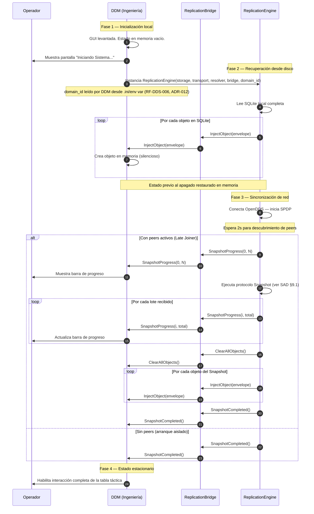

# Interface Control Document (ICD)

**Proyecto:** ReplicationEngine  
**Versión:** 2.0  
**Fecha:** 2026-04-16  
**Estado:** DA-01 y DA-02 cerradas. Secciones 4, 5 y 7 actualizadas con firma concreta (`IReplicationListener`).

---

## Historial de Revisiones

| Versión | Fecha      | Autor       | Descripción                                                                 |
|---------|------------|-------------|-----------------------------------------------------------------------------|
| 1.7     | 2026-03-31 | Equipo SiOp | Versión original en Google Docs                                             |
| 2.0     | 2026-04-16 | Equipo SiOp | Migración a Markdown. Interfaz redefinida de forma agnóstica al mecanismo. Eliminación de referencias a Qt signals/slots como mecanismo concreto. Referencias a ADRs. |

---

## Tabla de Contenidos

1. [Introducción](#1-introducción)
2. [Principios de Integración](#2-principios-de-integración)
3. [Gestión del Ciclo de Vida de Objetos](#3-gestión-del-ciclo-de-vida-de-objetos)
4. [Interfaz DDM → ReplicationEngine](#4-interfaz-ddm--replicationengine)
5. [Interfaz ReplicationEngine → DDM](#5-interfaz-replicationengine--ddm)
6. [Estructura del Objeto Compartido (Envelope)](#6-estructura-del-objeto-compartido-envelope)
7. [Señales de Estado y Feedback al Operador](#7-señales-de-estado-y-feedback-al-operador)
8. [Secuencia de Arranque](#8-secuencia-de-arranque)
9. [Análisis del Mecanismo de Comunicación](#9-análisis-del-mecanismo-de-comunicación)
10. [Restricciones y Decisiones Abiertas](#10-restricciones-y-decisiones-abiertas)

---

## 1. Introducción

### 1.1 Propósito

Este documento es el contrato técnico formal entre el **Área de Ingeniería** (responsable de DDM, la lógica de negocio y la interfaz gráfica) y el **Área de Sistemas Operativos** (responsable de ReplicationEngine, la persistencia y el middleware de red).

Define qué eventos existen entre ambos sistemas, qué datos transportan y qué comportamiento se espera de cada parte. ReplicationEngine se integra como librería `.so` linkeada por DDM (ADR-001 cerrado). DDM implementa la interfaz `IReplicationListener` y registra su instancia en ReplicationBridge (ADR-002 cerrado).

### 1.2 Alcance

Este documento cubre exclusivamente la interfaz entre **DDM** y **ReplicationEngine** a través del módulo **ReplicationBridge**. No cubre la comunicación entre nodos de la red (eso pertenece al SAD, sección 8).

### 1.3 Partes Involucradas

| Área | Responsabilidad en esta interfaz |
|------|----------------------------------|
| **Ingeniería (DDM)** | Genera objetos tácticos (asigna GUID, serializa a JSON, construye el Envelope). Recibe objetos provenientes de otros nodos y los deserializa. Expone métodos para que ReplicationEngine inyecte o elimine objetos en su estado interno. |
| **Sistemas Operativos (ReplicationEngine)** | Recibe objetos desde DDM y los distribuye a la red y persiste localmente. Notifica a DDM cuando llegan objetos desde otros nodos. Notifica estado de red y progreso de sincronización. |

### 1.4 Documentos Relacionados

| Documento | Descripción |
|-----------|-------------|
| `docs/srs/SRS.md` | Requisitos funcionales — RF-RB-001, RF-RB-002, RF-RB-003 |
| `docs/sad/SAD.md` | Arquitectura del sistema, módulo ReplicationBridge |
| `docs/sdd/SDD.md` | Diseño detallado de ReplicationBridge |
| `decisions/ADR-001-proceso-vs-libreria.md` | **Cerrado** — RE es librería `.so` |
| `decisions/ADR-002-replicationbridge-mechanism.md` | **Cerrado** — `IReplicationListener` |
| `docs/GLOSSARY.md` | Glosario de términos |

---

## 2. Principios de Integración

### 2.1 Agnosticismo de Carga Útil

ReplicationEngine es un **transporte ciego y confiable**. No interpreta, no valida, no transforma el contenido táctico. Recibe un Envelope con metadatos y un JSON Payload opaco, lo distribuye y lo persiste. Cualquier evolución en la estructura interna del dato táctico es responsabilidad exclusiva de Ingeniería y no requiere cambios en ReplicationEngine.

### 2.2 Separación de Responsabilidades

| Responsabilidad | Área |
|----------------|------|
| Generar el GUID (UUID v4) | **Ingeniería (DDM)** |
| Generar el timestamp `last_updated` | **Ingeniería (DDM)** — en el momento semántico exacto del evento |
| Serializar el objeto a JSON | **Ingeniería (DDM)** |
| Deserializar el JSON al recibir un objeto | **Ingeniería (DDM)** |
| Distribuir el Envelope por la red | **Sistemas Operativos (ReplicationEngine)** |
| Persistir el Envelope en SQLite | **Sistemas Operativos (ReplicationEngine)** |
| Resolver conflictos (LWW) | **Sistemas Operativos (ReplicationEngine)** |
| Lógica de negocio y renderización visual | **Ingeniería (DDM)** |

> **Crítico — generación del timestamp:** El campo `last_updated` debe ser generado por DDM en el momento semántico exacto del evento (cuando el sensor detectó el objeto o el operador interactuó con él). Si se generara al ingresar a ReplicationEngine, incluiría la latencia variable de la cola de eventos, restando confiabilidad al algoritmo LWW.

### 2.3 Asimetría Local/Remoto — Invariante del Contrato - Prevención de Ecos en la Red

Todo evento que cruza la frontera DDM ↔ ReplicationEngine tiene un origen unívoco. Este origen determina la dirección del flujo y nunca se invierte. Esta propiedad es un **invariante bilateral**: ambas partes tienen una garantía y una obligación recíprocas.

**Flujo local (DDM → RE)**

DDM detecta un evento originado en su propio dominio (operador o sensor local) y notifica a RE vía `onLocalObjectUpserted` / `onLocalObjectDeleted`. RE persiste y publica en la red. RE **garantiza** que nunca invocará `onInjectObject` de vuelta con ese objeto — DDM no recibirá eco de sus propios eventos.

**Flujo remoto (RE → DDM)**

RE recibe un objeto desde la red DDS y, tras resolver el conflicto LWW, invoca `onInjectObject` / `onRemoveObject` en DDM. DDM **garantiza** que no re-notificará a RE con ese objeto. Hacerlo generaría un bucle de retroalimentación infinita.

> **Consecuencia práctica para DDM:** toda llamada entrante a `onInjectObject` es, por contrato, de origen remoto. DDM no necesita rastrear ni marcar el origen de cada objeto recibido para evitar el eco — la separación está garantizada por la arquitectura de RE (el Worker Thread solo invoca `onInjectObject` desde `RemoteUpsertEvent`, nunca desde `LocalUpsertEvent`).

La interfaz `IReplicationBridge` materializa esta separación: los métodos `onLocalObject*` son la única vía por la que DDM introduce eventos en RE, y los métodos `IReplicationListener` son la única vía por la que RE notifica a DDM.

### 2.4 Soberanía de Persistencia

No todo objeto que existe en DDM debe cruzar la frontera hacia ReplicationEngine. DDM decide qué objetos tienen valor táctico persistente y cuáles son transitorios. Ver sección 3.

---

## 3. Gestión del Ciclo de Vida de Objetos

### 3.1 Objetos Transitorios (Solo Memoria en DDM)

Elementos visuales efímeros que viven únicamente en el estado interno de DDM. Si la consola se apaga, se pierden. DDM **no notifica** a ReplicationEngine sobre estos objetos.

Ejemplos: cursores de medición temporal, selecciones de UI, borradores de tracks no confirmados por el operador.

### 3.2 Objetos Persistentes (Red y Base de Datos)

Elementos con valor táctico real. Cuando DDM decide que un objeto tiene este valor, construye el Envelope completo y lo entrega a ReplicationEngine.

**Regla de oro:** Todo objeto que cruce la frontera hacia ReplicationEngine será persistido en SQLite y transmitido a toda la red sin excepción. No existen filtros ni excepciones en la capa de ReplicationEngine.

Ejemplos: tracks confirmados, figuras de área de exclusión, puntos de interés.

### 3.3 Decisión de Persistencia

La decisión de si un objeto es transitorio o persistente es **exclusiva de Ingeniería**. Sistemas Operativos no participa en esta decisión ni la puede inferir.

---

## 4. Interfaz DDM → ReplicationEngine

Esta sección define los eventos que DDM debe emitir hacia ReplicationEngine cuando ocurre un cambio de origen local.

> ℹ️ **DA-01 y DA-02 cerradas:** DDM notifica a ReplicationEngine llamando métodos de la interfaz `IReplicationEngine` (objetos tácticos y recuperación de fallos) y registra su listener vía `IReplicationBridge`. El mecanismo concreto es: DDM llama directamente a los métodos de la librería desde el hilo Qt. Estos métodos encolan el evento en la cola thread-safe de RE y retornan inmediatamente.

> ⚠️ **Condición crítica de eco:** Estos eventos **solo deben emitirse cuando el cambio es de origen local** (operador o sensor local). Nunca deben emitirse como reacción a una inyección remota de ReplicationEngine (sección 5). Violar esta condición genera tormentas de broadcast.

---

### Evento: ObjectAdded

**Cuándo:** El operador confirma la creación de un nuevo objeto persistente.  
**Datos:** Envelope completo (`ReplicatedObjectStruct`). Ver sección 6.  
**Comportamiento esperado de ReplicationEngine:** Persiste el objeto en SQLite y lo publica en el tópico `RealTimeReplication`.

---

### Evento: ObjectModified

**Cuándo:** Una propiedad táctica del objeto cambia y debe replicarse (cinemática, identidad, etc.).  
**Datos:** Envelope completo (`ReplicatedObjectStruct`) con el estado actualizado y un nuevo `last_updated`.  
**Comportamiento esperado de ReplicationEngine:** Evalúa LWW. Si el timestamp es mayor al persistido, actualiza SQLite y publica en `RealTimeReplication`.

---

### Evento: ObjectDeleted

**Cuándo:** El operador confirma la eliminación de un objeto táctico persistente.  
**Datos:** `guid` del objeto eliminado.  
**Comportamiento esperado de ReplicationEngine:** Ejecuta dos acciones concurrentes e independientes:
1. Elimina físicamente el registro de SQLite (borrado definitivo, sin tombstones).
2. Publica una `DeletionNotification` (`guid` + `source_console_id`) en el tópico `DeletionNotification` con `RELIABILITY=RELIABLE`.

> Los nodos que no estén conectados al momento del borrado no recibirán esta notificación. Obtendrán el estado depurado a través del Snapshot al reintegrarse.

---

### Evento: ReconnectTransport

**Cuándo:** El operador solicita reconexión de red tras un fallo del middleware DDS (`NetworkStatus::TRANSPORT_FAILED`).  
**Datos:** Ninguno.  
**Interfaz:** `IReplicationEngine::reconnectTransport()`. Ver ADR-009, ADR-011.  
**Comportamiento esperado de ReplicationEngine:** Intenta `disconnect()` + `connect()` en DDSTransport. Si exitoso, ejecuta startup sequence normal y notifica `CONNECTED` o `DISCONNECTED` según haya peers. Si falla, notifica `TRANSPORT_FAILED` nuevamente.

---

### Evento: ReinitializeStorage

**Cuándo:** El operador solicita reinicialización de la BD SQLite tras un fallo de almacenamiento (`NetworkStatus::STORAGE_FAILED`).  
**Datos:** Ninguno.  
**Interfaz:** `IReplicationEngine::reinitializeStorage()`. Ver ADR-010, ADR-011.  
**Comportamiento esperado de ReplicationEngine:** Cierra y elimina `tactical_db.db`, recrea la BD vacía, ejecuta startup sequence completa como late joiner para repoblar SQLite desde la red.

---

## 5. Interfaz ReplicationEngine → DDM

Esta sección define los métodos que DDM debe exponer para que ReplicationEngine pueda inyectar objetos provenientes de la red o repoblar el estado ante un reinicio.

> ℹ️ **DA-01 y DA-02 cerradas:** ReplicationEngine invoca estos métodos llamando a `IReplicationListener` desde su Worker Thread. DDM implementa `IReplicationListener` en `CommandContext` y es responsable del marshal al hilo principal de Qt en cada método:
> ```cpp
> void CommandContext::onInjectObject(const ReplicatedObject& obj) override {
>     // Ejecutado en Worker Thread de RE — marshal al hilo Qt
>     QMetaObject::invokeMethod(this, [this, obj]() {
>         injectRemoteObject(obj); // seguro en hilo Qt
>     }, Qt::QueuedConnection);
> }
> ```

> ⚠️ **Condición crítica de eco:** Las implementaciones de estos métodos **no deben disparar los eventos de la sección 4**. Hacerlo generaría un eco de red. Toda actualización del estado interno de DDM originada por estos métodos es silenciosa.

---

### Método: InjectObject

**Invocado por ReplicationEngine cuando:** Llega un objeto desde la red (tópico `RealTimeReplication`) o cuando se repobla el estado desde SQLite al arrancar.  
**Datos recibidos:** Envelope completo (`ReplicatedObjectStruct`).  
**Comportamiento esperado de DDM:**
- Extrae el `guid`.
- Si el objeto no existe en memoria: lo crea.
- Si el objeto ya existe: actualiza sus propiedades parseando el `json_payload`.
- Actualiza la UI de forma silenciosa.
- **No dispara ObjectModified.**

---

### Método: RemoveObject

**Invocado por ReplicationEngine cuando:** Se recibe una notificación en el tópico `DeletionNotification` (borrado propagado por otro nodo activo).  
**Datos recibidos:** `guid` del objeto a eliminar.  
**Comportamiento esperado de DDM:**
- Elimina el objeto de las vistas y de la memoria interna.
- Si el `guid` no existe en DDM (notificación duplicada o fuera de orden): la operación se completa sin error y sin efectos secundarios. Solo logging diagnóstico.
- **No dispara ObjectDeleted bajo ninguna circunstancia.**

---

### Método: ClearAllObjects

**Invocado por ReplicationEngine cuando:** Se completa la recepción de un Snapshot y se va a repoblar el estado completo desde la nueva base de datos.  
**Datos recibidos:** Ninguno.  
**Comportamiento esperado de DDM:**
- Limpia todos los objetos persistentes en memoria.
- La UI queda en estado vacío hasta que ReplicationEngine llame a `InjectObject` por cada objeto de la nueva base de datos.
- **No dispara ObjectDeleted para ningún objeto.**

---

## 6. Estructura del Objeto Compartido (Envelope)

La unidad de intercambio entre DDM y ReplicationEngine es el **Envelope**: una estructura que combina metadatos de enrutamiento con un payload semántico opaco.

### 6.1 Definición de la Estructura

```cpp
struct ReplicatedObjectStruct {
    std::string guid;              // UUID v4. PK en SQLite y en la red DDS.
    int         object_type;       // Categoría del objeto. Opaco para SiOp.
    int         source_console_id; // ID de la consola emisora.
    int64_t     last_updated;      // Timestamp Unix (ms). Usado por LWW.
    std::string json_payload;      // Estado táctico completo. Opaco para SiOp. Máx. 4 KB.
};
```

### 6.2 Tabla de Responsabilidades por Campo

| Campo | Tipo C++ | Generado por | Leído por | Descripción |
|-------|----------|-------------|-----------|-------------|
| `guid` | `std::string` | **Ingeniería** | Ambos | UUID v4. Identifica unívocamente el objeto en toda la red. Reemplaza al antiguo `track_id` entero. |
| `object_type` | `int` | **Ingeniería** | Ingeniería (filtrado/visualización) | Categoría del objeto (ej. 1=Track, 2=Cursor, 3=Área). SiOp lo almacena y transmite como entero opaco. |
| `source_console_id` | `int` | **Ingeniería** | Ambos (auditoría) | ID de la consola que originó el mensaje. |
| `last_updated` | `int64_t` | **Ingeniería** | **SiOp** (LWW) | Timestamp Unix en milisegundos. Debe generarse en el momento semántico exacto del evento en DDM. SiOp lo usa para comparar y descartar mensajes obsoletos. |
| `json_payload` | `std::string` | **Ingeniería** | **Ingeniería** | Contenido táctico completo serializado. SiOp lo trata como bytes opacos. Máximo 4 KB (RNF-09 del SRS). |

### 6.3 Restricciones

| Restricción | Valor | Fuente |
|-------------|-------|--------|
| Tamaño máximo de `json_payload` | 4 KB | RNF-09 del SRS |
| Formato de `guid` | UUID v4 | SAD sección 7.1 |
| Formato de `last_updated` | Unix timestamp en milisegundos (`int64_t`) | SAD sección 7.1 — evita problema del año 2038 |

### 6.4 Responsabilidades Exclusivas de Ingeniería

Para evitar ambigüedades, se explicita que las siguientes responsabilidades pertenecen íntegramente a Ingeniería y no serán asumidas por SiOp en ningún caso:

- Ordenamiento de la tabla táctica (por CPP, número de track, amenaza).
- Conversión de coordenadas decimales a formato GMS para la pantalla.
- Asignación y rotación de números de track visuales (0–999). ReplicationEngine solo conoce el `guid`.
- Lógica de negocio sobre el contenido del `json_payload`.

---

## 7. Señales de Estado y Feedback al Operador

ReplicationEngine expone eventos de estado para que DDM pueda mantener informado al operador. DDM decide cómo representar visualmente esta información.

> ℹ️ **DA-02 cerrada:** ReplicationEngine notifica a DDM invocando los métodos correspondientes de `IReplicationListener`. DDM hace marshal Qt en cada implementación.

| Evento | Datos | Descripción |
|--------|-------|-------------|
| `NetworkStatusChanged` | `status_code: int` | Cambio en el estado del sistema. Valores definidos en el enum `NetworkStatus` (ver §7.1). |
| `SnapshotProgress` | `current_batch: int`, `total_batches: int` | Progreso de recepción del Snapshot. Permite a DDM mostrar una barra de progreso ("Recuperando historial táctico: Lote 5 de 20..."). |
| `SnapshotCompleted` | — | La base de datos está completamente sincronizada con el líder de la red. Es seguro habilitar la interacción completa de la tabla táctica en la GUI. |

### 7.1 Enum NetworkStatus

Los valores del parámetro `status` de `onNetworkStatusChanged` están definidos formalmente. RE exporta este enum en su header público.

```cpp
// include/ReplicationBridge/NetworkStatus.h
namespace replication_engine {

enum class NetworkStatus : int {
    DISCONNECTED      = 0,  // Sin peers. Operación aislada normal (RF-RE-005).
    CONNECTED         = 1,  // Operación normal con peers descubiertos.
    SYNCING           = 2,  // Recibiendo Snapshot de un líder.
    TRANSPORT_FAILED  = 3,  // Middleware DDS caído en runtime. Ver ADR-009.
    STORAGE_FAILED    = 4,  // SQLite caído en runtime. Ver ADR-010.
};

} // namespace replication_engine
```

`DISCONNECTED` y `CONNECTED` son estados operativos normales. `SYNCING` es transitorio durante la recepción de un Snapshot. `TRANSPORT_FAILED` y `STORAGE_FAILED` son estados de degradación que requieren intervención del operador vía `reconnectTransport()` o `reinitializeStorage()` respectivamente.

---

## 8. Secuencia de Arranque

El ciclo de inicio debe ser orquestado para asegurar coherencia de datos antes de habilitar la interacción del operador.



---

## 9. Mecanismo de Comunicación (DA-01 y DA-02 Cerradas)

### 9.1 Decisiones Tomadas

| Decisión | Resultado |
|----------|-----------|
| DA-01 (ADR-001) | ReplicationEngine es librería `.so` linkeada por DDM |
| DA-02 (ADR-002) | Interfaz abstracta pura `IReplicationListener` — patrón Observer |

### 9.2 Flujo Completo de Comunicación

```
┌─────────────────────────────────────────────────────────────────┐
│  Proceso DDM (Qt)                                               │
│                                                                  │
│  CommandContext : public IReplicationListener                   │
│      │                                                           │
│      │  DDM → RE (hilo Qt llama método de la librería)          │
│      ▼                                                           │
│  IReplicationEngine::onLocalObjectUpserted(obj)                 │
│      │                                                           │
│      │  encola en cola thread-safe — retorna inmediatamente     │
│      ▼                                                           │
│  [Worker Thread RE]                                              │
│      ├── ObjectStorage::upsert(obj)                             │
│      └── DDSTransport::publishObject(obj)                       │
│                                                                  │
│  RE → DDM (Worker Thread invoca IReplicationListener)           │
│      ▼                                                           │
│  CommandContext::onInjectObject(obj)   ← ejecuta en Worker Thread│
│      │                                                           │
│      │  marshal al hilo Qt (QMetaObject::invokeMethod)          │
│      ▼                                                           │
│  injectRemoteObject(obj)               ← ejecuta en hilo Qt     │
└─────────────────────────────────────────────────────────────────┘
```

### 9.3 Interfaz que DDM debe implementar

```cpp
// Definida por RE en include/ReplicationBridge/IReplicationListener.h
// DDM hereda esta interfaz en CommandContext (o clase fachada equivalente)

class IReplicationListener {
public:
    virtual ~IReplicationListener() = default;

    // RE → DDM: objeto recibido de la red o repoblación desde disco
    virtual void onInjectObject(const ReplicatedObject& obj)    = 0;

    // RE → DDM: borrado recibido de la red
    virtual void onRemoveObject(const std::string& guid)        = 0;

    // RE → DDM: limpiar estado antes de repoblar desde Snapshot
    virtual void onClearAllObjects()                            = 0;

    // RE → DDM: progreso de recepción de Snapshot
    virtual void onSnapshotProgress(int current, int total)     = 0;

    // RE → DDM: sincronización completa — habilitar UI
    virtual void onSnapshotCompleted()                          = 0;

    // RE → DDM: cambio de estado de red
    virtual void onNetworkStatusChanged(int status)             = 0;
};
```

### 9.4 Responsabilidad de Marshal (Equipo Ingeniería)

Cada método de `IReplicationListener` se ejecuta en el **Worker Thread de RE**, no en el hilo Qt. DDM **debe** hacer el marshal antes de tocar cualquier `QObject`:

```cpp
// Implementación en CommandContext (responsabilidad de Ingeniería)
void CommandContext::onInjectObject(const ReplicatedObject& obj) override {
    // ⚠️ Este método se ejecuta en el Worker Thread de RE
    QMetaObject::invokeMethod(this, [this, obj]() {
        // ✅ Esto se ejecuta en el hilo Qt — seguro tocar QObjects
        injectRemoteObject(obj);
    }, Qt::QueuedConnection);
}
```

> **Crítico:** No hacer el marshal y tocar un `QObject` directamente desde el Worker Thread de RE causará crashes o corrupción de estado. Ver ADR-001 análisis de Qt threading.

---

## 10. Restricciones y Decisiones Abiertas

| ID | Descripción | Estado | ADR |
|----|-------------|--------|-----|
| **DA-01** | ¿ReplicationEngine opera como proceso independiente o como librería `.so`? | **Cerrado — Librería `.so`** | `ADR-001-proceso-vs-libreria.md` |
| **DA-02** | Mecanismo de comunicación entre DDM y ReplicationBridge. | **Cerrado — `IReplicationListener`** | `ADR-002-replicationbridge-mechanism.md` |
| **DA-03** | ¿Quién lee el Domain ID de DDS (RF-DDS-006): ReplicationEngine o DDM? | **Cerrado — DDM lo lee e inyecta por constructor** | `ADR-012-domain-id-source.md` |

No quedan decisiones abiertas en este documento. Las decisiones pendientes del proyecto se encuentran en ADR-003 (nombre DDSTransport).

---

_Documento generado y mantenido en Markdown. Para editar, realizar un Merge Request en GitLab siguiendo el flujo estándar del proyecto._