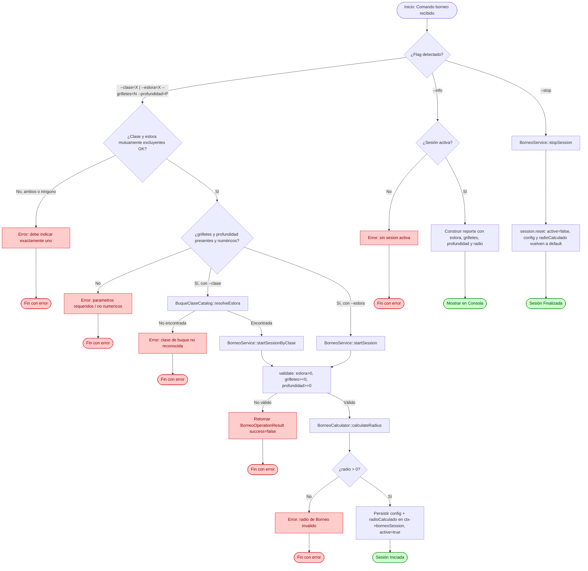

# Flujo: Círculo de Borneo (CB)

## Descripción general

Este flujo documenta la gestión y el cálculo del **Círculo de Borneo** para la fase de pos-fondeo del Buque Propio. A partir de la eslora de la unidad (seleccionada por clase de buque o ingresada manualmente), la cantidad de grilletes de cadena filados y la profundidad del fondeo, el sistema calcula el radio de seguridad de oscilación (borneo) alrededor del punto de ancla.

Borneo es un **cálculo puntual**: se ejecuta una vez al iniciar la sesión y el resultado queda fijo en el estado hasta que el operador modifica los parámetros de entrada y vuelve a invocar el comando, o finaliza la sesión con `--stop`.

---

## Lista de archivos y clases

| Archivo | Clase/Struct | Responsabilidad |
|---|---|---|
| `src/controller/commands/borneoCommand.cpp` | `BorneoCommand` | Entrada CLI para iniciar (`--clase` / `--eslora`, `--grilletes`, `--profundidad`), detener (`--stop`) y consultar (`--info`) la sesión de Borneo. |
| `src/controller/services/borneoService.cpp` | `BorneoService` | Orquestador del ciclo de vida de la sesión (start/stop), validación de negocio y resolución de eslora por catálogo. |
| `src/model/borneo/borneoCalculator.cpp` | `BorneoCalculator` | Motor matemático puro encargado de resolver el radio del Círculo de Borneo. |
| `src/model/borneo/borneoSessionState.h` | `BorneoSessionState`, `BorneoConfig`, `BorneoConstants` | Estructura de datos que persiste la configuración y el resultado calculado de la sesión; constantes fijas del cálculo. |
| `src/model/borneo/buqueClaseCatalog.cpp` | `BuqueClaseCatalog` | Catálogo estático que resuelve la eslora en metros a partir de una clase de buque predefinida. |
| `src/model/commandContext.h` | `CommandContext` | Contenedor global que aloja la sesión activa `borneoSession` dentro del pipeline del sistema. |

---

## Clases principales

### BorneoCommand

- **Rol**: Wrapper CLI encargado exclusivamente del análisis sintáctico de tokens. No contiene reglas de negocio: delega toda validación y ejecución a `BorneoService`, devolviendo directamente el `BorneoOperationResult` recibido.

- **Métodos clave**:

| Método | Firma | Descripción |
|---|---|---|
| Ejecutar | `CommandResult execute(const CommandInvocation& inv, CommandContext& ctx) const` | Modula entre los modos operativos (`--info`, `--stop`, o inicialización de sesión). |
| Iniciar | `CommandResult handleIniciar(const CommandInvocation& inv, CommandContext& ctx) const` | Extrae `--clase`/`--eslora`, `--grilletes`, `--profundidad`; valida forma (mutua exclusión clase/eslora, presencia, tipos numéricos) e invoca `BorneoService`. |
| Finalizar | `CommandResult handleFinalizar(CommandContext& ctx) const` | Invoca `BorneoService::stopSession()`. |
| Info | `CommandResult handleInfo(const CommandContext& ctx) const` | Construye el reporte de la sesión activa vía `infoReport()`. |

- **Validación en CLI**: limitada a la conversión de tipos primitivos (`toInt`, `toDouble`) y a que `--clase` y `--eslora` sean mutuamente excluyentes (exactamente uno de los dos debe estar presente). Las reglas de negocio (rangos, existencia de la clase en catálogo) se resuelven en `BorneoService`.

- **Formato de `--clase`**: el catálogo indexa las claves con guion bajo (`MEKO_360`, `MEKO_140`, `PATAGONIA`).

### BorneoService

- **Rol**: Interfaz de control operativo que centraliza las reglas de validación de negocio (eslora > 0, grilletes ≥ 0, profundidad ≥ 0), resuelve la eslora por catálogo cuando corresponde, manipula el estado de la sesión y actúa como puente hacia el calculador. Todos los métodos públicos de operación devuelven una estructura uniforme `BorneoOperationResult { bool success; QString message; }`.

- **Métodos clave**:

| Método | Firma | Descripción |
|---|---|---|
| Iniciar por eslora manual | `BorneoOperationResult startSession(const BorneoConfig& config)` | Valida la configuración y calcula el radio directamente con la eslora provista (opción "OTRO"). |
| Iniciar por clase de buque | `BorneoOperationResult startSessionByClase(const QString& clase, int grilletes, double profundidad)` | Resuelve la eslora vía `BuqueClaseCatalog::resolveEslora`; si la clase no existe, retorna error sin calcular. |
| Finalizar Sesión | `BorneoOperationResult stopSession()` | Valida que haya sesión activa y limpia el estado completo vía `session.reset()` (active, config y radioCalculado vuelven a sus valores por defecto). |
| Helper interno | `QString validate(const BorneoConfig& config) const` | Verifica eslora > 0, grilletes ≥ 0, profundidad ≥ 0. Devuelve string vacío si es válido, o el mensaje de error correspondiente. |
| Helper interno | `BorneoOperationResult startSessionInternal(const BorneoConfig& config)` | Punto único de validación + cálculo + persistencia en `ctx->borneoSession`, usado por ambos modos de inicio. |

### BorneoCalculator

- **Rol**: Motor de cómputo plano, sin estado, que resuelve el radio del Círculo de Borneo.
- **Métodos clave**:

| Método | Firma | Descripción |
|---|---|---|
| Calcular | `static double calculateRadius(const BorneoConfig& config)` | `CB = Eslora + (Grilletes × 27.43) + MargenSeguridad(10) − Profundidad`. |

- **Consideraciones técnicas del motor**:
  - **Conversión de unidades**: utiliza la constante fija `GRILLETE_LENGTH_MTS = 27.43` (metros por grillete de cadena) definida en `BorneoConstants`.
  - **Margen de seguridad**: constante fija `MARGEN_SEGURIDAD_MTS = 10.0`, sumada siempre al resultado.
  - **Unidad de trabajo**: Borneo calcula y expresa el resultado en **Metros (MTS)**, conforme a la doctrina naval de maniobras de fondeo.

### BuqueClaseCatalog

- **Rol**: Catálogo estático de solo lectura que resuelve la eslora en metros de una clase de buque predefinida, para autocompletar el campo "ESLORA BP".
- **Métodos clave**:

| Método | Firma | Descripción |
|---|---|---|
| Resolver | `static bool resolveEslora(const QString& clase, double& outEslora)` | Normaliza la clase recibida a mayúsculas y busca coincidencia exacta contra las claves del catálogo. Devuelve `true` y completa `outEslora` si existe. |

- **Datos actuales del catálogo**: `MEKO_360 = 125.0 mts`, `MEKO_140 = 91.2 mts`, `PATAGONIA = 157.8 mts`.
- **Extensibilidad**: agregar una nueva clase de buque implica únicamente sumar una entrada al mapa estático interno; no requiere tocar `BorneoService` ni `BorneoCommand`.

---

## Flujo de datos (Ciclo de Vida del Comando)



### Flujo CLI (Paso a Paso)

El usuario ejecuta el comando en la consola utilizando alguna de las siguientes sintaxis:

```bash
borneo --clase=<MEKO_360|MEKO_140|PATAGONIA> --grilletes=<n> --profundidad=<mts>
borneo --eslora=<mts> --grilletes=<n> --profundidad=<mts>
borneo --stop
borneo --info
```

1. `BorneoCommand::execute` intercepta los argumentos vía `extractOpt`/`hasFlag` y determina el modo invocado (`--info`, `--stop`, o inicialización).
2. En modo inicialización, `handleIniciar` valida forma: que `--clase` y `--eslora` sean mutuamente excluyentes, que `--grilletes` y `--profundidad` estén presentes, y que ambos sean convertibles a tipos numéricos (`toInt`, `toDouble`). Estas son validaciones de sintaxis, no de negocio.
3. Según el disparador usado, se invoca `BorneoService::startSessionByClase` (resuelve eslora por catálogo primero) o `BorneoService::startSession` (eslora manual, opción "OTRO" de la UI).
4. `BorneoService` corre `validate()` sobre la configuración resuelta; si falla, devuelve `BorneoOperationResult{success=false, message}` sin calcular ni persistir nada.
5. Si la validación pasa, `BorneoCalculator::calculateRadius` resuelve el radio y `BorneoService` persiste `BorneoConfig` + `radioCalculado` en `ctx->borneoSession`, marcando `active=true`.
6. El resultado de cualquier operación —exitosa o fallida— se devuelve como `BorneoOperationResult`, que `BorneoCommand` traduce directamente a `CommandResult`.

> **Nota**: Borneo no tiene bucle de recálculo continuo. Si el operador cambia un parámetro mientras la sesión está activa, debe volver a invocar `borneo --clase=... --grilletes=... --profundidad=...`, lo que sobreescribe la configuración anterior sin necesidad de `--stop` previo.

---

## Estructuras de Datos Clave

### Configuración de Sesión (`BorneoConfig`)

Datos ingresados por el operador, inmutables durante el cálculo:

- **`eslora`**: ESLORA BP en metros (resuelta por catálogo o ingresada manualmente).
- **`grilletes`**: GRILLETES AL AGUA, cantidad entera de grilletes de cadena filados.
- **`profundidad`**: PROFUNDIDAD del fondeo en metros.

### Estado de Sesión (`BorneoSessionState`)

- **Datos de control**: `active`.
- **Configuración**: `config` (`BorneoConfig`).
- **Resultado calculado**: `radioCalculado`, RADIO DE BORNEO en metros.

### Constantes (`BorneoConstants`)

- **`GRILLETE_LENGTH_MTS = 27.43`**: longitud fija de un grillete de cadena.
- **`MARGEN_SEGURIDAD_MTS = 10.0`**: margen de seguridad fijo sumado al radio.

---

## Manejo de Errores y Casos de Borde

- **Mutua exclusión clase/eslora**: `BorneoCommand::handleIniciar` rechaza la invocación si ambos flags (`--clase` y `--eslora`) están presentes simultáneamente, o si ninguno lo está.
- **Clase de buque no reconocida**: si `--clase` no coincide con ninguna entrada de `BuqueClaseCatalog`, `startSessionByClase` retorna error sin calcular ni persistir.
- **Valores no numéricos**: `--grilletes` y `--profundidad` se validan con `toInt`/`toDouble`; si la conversión falla, el comando rechaza antes de llegar al servicio.
- **Validación de negocio**: `BorneoService::validate` rechaza eslora ≤ 0, grilletes < 0 o profundidad < 0.
- **Sin sesión activa**: `--info` y `--stop` retornan error explícito si `ctx->borneoSession.active == false`.
- **Finalización con limpieza de estado**: `stopSession` invoca `session.reset()`, que restablece `active`, `config` (eslora, grilletes, profundidad) y `radioCalculado` a sus valores por defecto en una única operación, evitando que queden residuos de una sesión anterior.
- **Radio calculado inválido (≤ 0)**: si `BorneoCalculator::calculateRadius` produce un resultado menor o igual a 0 (profundidad grande respecto a eslora + grilletes + margen), `startSessionInternal` rechaza el inicio de la sesión sin persistir ningún estado, devolviendo un mensaje de advertencia: *"Advertencia: los valores ingresados producen un radio de Borneo invalido (X.XX mts). Verifique eslora, grilletes y profundidad."*

---

## Módulos Relacionados

- *(Nota: el módulo de Círculo de Borneo todavía no tiene dependencia implementada con Fondeo. Existe un `TODO` comentado en `BorneoService::startSessionInternal` para validar la existencia de un punto de Fondeo activo antes de iniciar sesión. Por indicación de los responsables del proyecto, esta dependencia se mantiene deshabilitada de forma intencional y momentánea: el sistema permite iniciar una sesión de Borneo sin verificar la existencia de un Fondeo activo. La integración queda pendiente.)*
