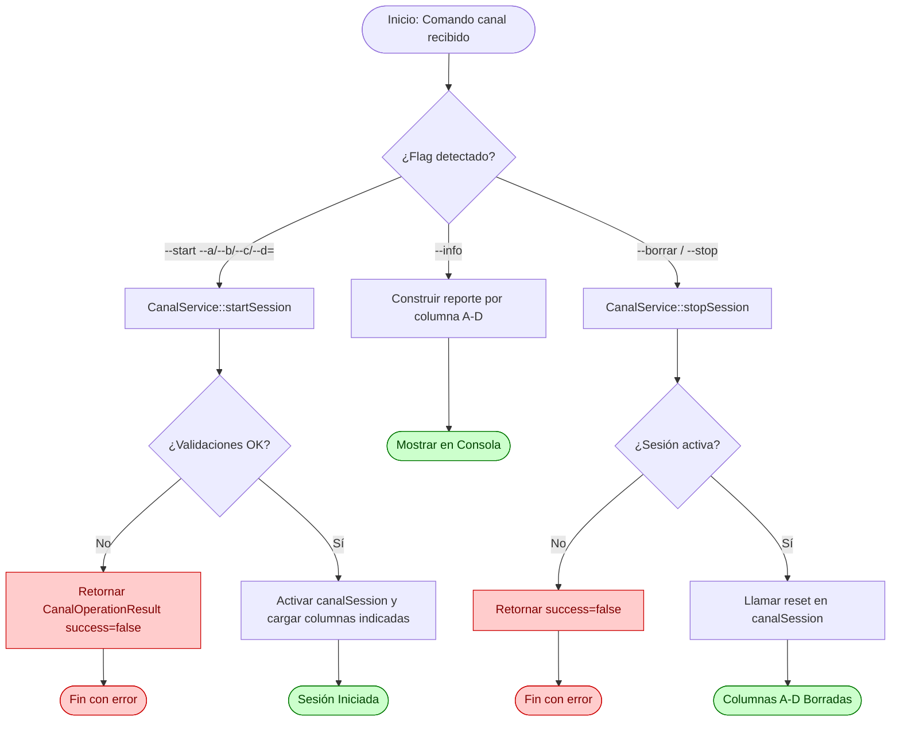
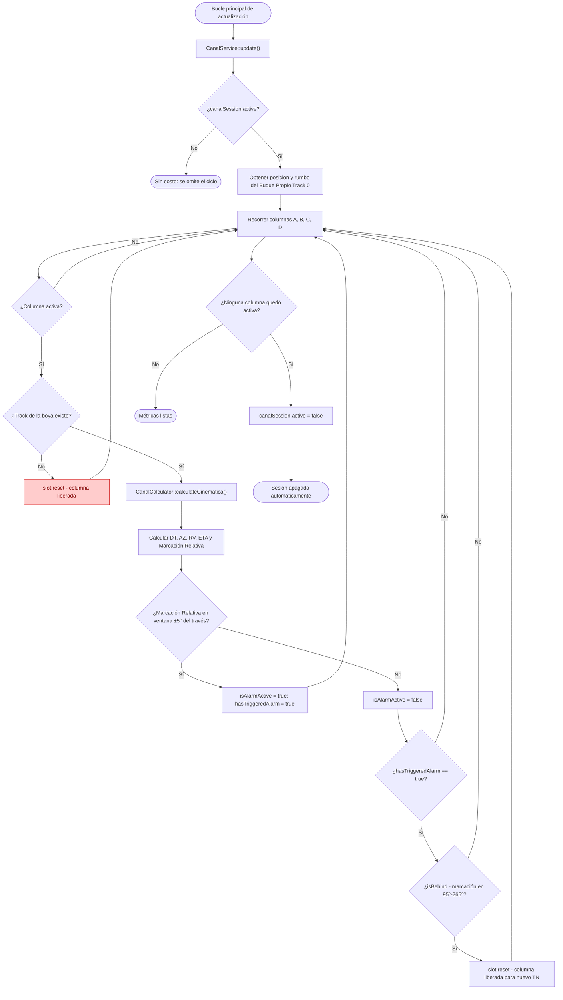

# Flujo: Asesoramiento Canal

## Descripción general

Este flujo documenta la gestión y el cálculo cinemático continuo del **Asesoramiento de Canal** para el Buque Propio (`ownShip`) respecto de hasta cuatro pares/boyas de referencia (Columnas A, B, C y D), utilizados para el ingreso/salida de canales boyados o accesos a puertos.

A partir de un track existente para cada columna, el sistema calcula en tiempo real el azimut verdadero, la distancia, el rumbo verdadero y el tiempo estimado de arribo (ETA) desde el Buque Propio hacia cada par/boya, además de una marcación relativa que dispara una alarma visual cuando el Buque Propio se encuentra al través (090°/270° relativo) del par/boya. Cada columna se resetea automáticamente una vez que la boya queda atrás, habilitando un ciclo continuo e ilimitado de asesoramientos.

---

## Lista de archivos y clases

| Archivo | Clase/Struct | Responsabilidad |
|---|---|---|
| `src/controller/commands/canalCommand.cpp` | `CanalCommand` | Entrada CLI para iniciar columnas (`--start --a/--b/--c/--d=<track>`), borrar la sesión (`--borrar`/`--stop`) y consultar el estado (`--info`). |
| `src/controller/services/canalService.cpp` | `CanalService` | Orquestador del ciclo de vida de la sesión (start/stop) e integrador con el bucle de actualización cinemática. |
| `src/model/canal/canalCalculator.cpp` | `CanalCalculator` | Motor matemático puro encargado de la cinemática (azimut, distancia, rumbo, ETA) y de la lógica de ventana de alarma. |
| `src/model/canal/canalSessionState.h` | `CanalSessionState`, `CanalSlot`, `CanalConfig` | Estructuras de entrada (configuración) y de estado dinámico persistido por cada una de las 4 columnas. |
| `src/model/commandContext.h` | `CommandContext` | Contenedor global que aloja la sesión activa `canalSession` dentro del pipeline del sistema. |

---

## Clases principales

### CanalCommand

- **Rol**: Wrapper CLI encargado del análisis sintáctico de tokens (`clave=valor` o flags booleanas). No contiene reglas de negocio ni cálculos: instancia `CanalService` y delega toda la validación y ejecución, devolviendo el `CanalOperationResult` recibido como `CommandResult`.

- **Métodos clave**:

| Método | Firma | Descripción |
|---|---|---|
| Ejecutar | `CommandResult execute(const CommandInvocation& inv, CommandContext& ctx) const` | Modula entre los modos operativos (`--info`, `--borrar`/`--stop`, o `--start` con carga de columnas). |

- **Validación en CLI**: limitada a la conversión de tipos primitivos (`toInt`) de los valores `--a`, `--b`, `--c`, `--d`, y a exigir al menos una columna al usar `--start`. Las reglas de negocio (existencia del track, columnas ya ocupadas) se resuelven en `CanalService`.

### CanalService

- **Rol**: Interfaz de control operativo que centraliza las reglas de validación de negocio (existencia de los tracks referenciados, columnas actualmente activas), manipula el estado de la sesión táctica y actúa como puente hacia el calculador. Los métodos públicos de operación devuelven una estructura uniforme `CanalOperationResult { bool success; QString message; }`.

- **Métodos clave**:

| Método | Firma | Descripción |
|---|---|---|
| Iniciar Sesión | `CanalOperationResult startSession(const CanalConfig& config)` | Valida que los tracks indicados existan y que las columnas objetivo no estén ya en uso (all-or-nothing), luego activa la sesión global y carga las columnas correspondientes. |
| Finalizar Sesión | `CanalOperationResult stopSession()` | Valida que haya sesión activa y llama a `reset()` sobre `canalSession`, limpiando las 4 columnas de una vez. |
| Actualización | `void update()` | Recorre las 4 columnas activas, obtiene la posición del Buque Propio (Track 0) y de cada boya, invoca el recálculo cinemático y evalúa la alarma/reseteo automático. |

### CanalCalculator

- **Rol**: Motor de cómputo plano que realiza la trigonometría de navegación (distancia, azimut, rumbo) y evalúa las condiciones angulares de alarma y de reseteo.
- **Métodos clave**:

| Método | Firma | Descripción |
|---|---|---|
| Calcular cinemática | `static void calculateCinematica(const QPointF& ownPos, double ownCourse, double ownSpeedDm, const QPointF& buoyPos, CanalSlot& outSlot)` | Calcula distancia en yardas, azimut verdadero, rumbo verdadero, ETA en minutos y marcación relativa `[0, 360)`. |
| Ventana de alarma | `static bool isWithinAlarmWindow(double relativeBearing)` | Devuelve `true` si la marcación relativa cae en `[85°, 95°]` o `[265°, 275°]` (± 5° respecto del través). |
| Boya superada | `static bool isBehind(double relativeBearing)` | Devuelve `true` si la marcación relativa está en `(95°, 265°)`, es decir, el Buque Propio ya dejó atrás el través del par/boya. |

- **Consideraciones técnicas del motor**:
  - **Conversión de unidades**: Convierte la distancia en Decámetros (DM) a yardas (`RadarMath::dmToYards`) para su presentación en pantalla.
---

## Flujo de datos (Ciclo de Vida del Comando)



### Flujo CLI (Paso a Paso)

El usuario ejecuta el comando en la consola utilizando la sintaxis de inicialización:

```bash
canal --start [--a=<track>] [--b=<track>] [--c=<track>] [--d=<track>]
canal --borrar
canal --info
```

1. `CanalCommand::execute` intercepta los argumentos y los procesa en un mapa local de opciones (`QMap<QString, QString> opts`), normalizando las claves a minúsculas y removiendo los guiones iniciales (`--`).
2. El comando realiza únicamente validaciones de forma: conversión de `--a/--b/--c/--d` a enteros y verificación de que se haya especificado al menos una columna al usar `--start`. Las reglas de negocio se delegan al servicio.
3. Se invoca `CanalService::startSession()`, que valida internamente la existencia de cada track y que las columnas objetivo no estén ocupadas. Si algún track es inválido, la operación falla por completo (**all-or-nothing**): no se cargan columnas parcialmente.

---

### Ciclo de Recálculo Continuo (Bucle Activo)

Al igual que otras disposiciones tácticas del sistema (p. ej. 2W), el asesoramiento de canal se evalúa de manera continua mediante `CanalService::update()`, invocado periódicamente desde el bucle principal de la aplicación:



---

## Estructuras de Datos Clave

### Configuración de entrada (`CanalConfig`)

Estructura que transporta la intención de carga desde `CanalCommand` hacia `CanalService`, con un par `set*`/`track*` independiente por columna (`setA/trackA`, `setB/trackB`, `setC/trackC`, `setD/trackD`), permitiendo cargar una, varias o las cuatro columnas en una sola invocación.

### Columna individual (`CanalSlot`)

Representa el estado y los resultados de una sola columna (A, B, C o D):

- **Datos de control**: `active`, `trackId`.
- **Outputs cinemáticos**: `azimutVerdadero`, `distanciaYardas`, `rumboVerdadero`, `timeToArrivalMin`, `etaValid`.
- **Outputs de Interfaz/Alarma**: `isAlarmActive`, `marcacionRelativa`, `hasTriggeredAlarm` (recuerda si la columna ya disparó la alarma, actuando como *seguro de memoria* para permitir el reseteo diferido).
- `reset()` reinicializa la columna completa a sus valores por defecto.

### Estado de Sesión (`CanalSessionState`)

- **Datos de control**: `active` (flag global de la sesión, equivalente al botón INICIAR).
- **Columnas**: `columnas[4]` (0=A, 1=B, 2=C, 3=D).
- `reset()` reinicializa las 4 columnas y el flag global de una sola vez (botón BORRAR).

---

## Manejo de Errores y Casos de Borde

- **Validación de existencia de tracks**: `CanalService::startSession` rechaza el pedido completo si cualquiera de los tracks indicados no existe en el sistema (`findTrackById`), sin cargar columnas parciales (**all-or-nothing**).
- **Protección de columnas en uso**: no se permite sobrescribir una columna ya activa; el operador debe esperar a que se libere sola o ejecutar `--borrar` primero.
- **Pérdida de referencia de una boya**: si el track de una columna es eliminado del sistema durante la sesión, `update()` detecta la ausencia y libera esa columna puntual (`slot.reset()`) sin afectar a las demás.
- **Tratamiento de indeterminaciones cinemáticas**: si la velocidad propia (`ownSpeedDm`) o la distancia son `0.0`, `etaValid` se fija en `false` y `timeToArrivalMin` en `0.0`, evitando división por cero.
- **Reseteo diferido con memoria (`hasTriggeredAlarm`)**: una columna solo se libera automáticamente cuando *ya sonó* la alarma (pasó por la ventana de ±5° del través) **y** la marcación relativa indica que la boya quedó efectivamente atrás (`isBehind`, rango 95°-265°). Esto evita que la columna se resetee prematuramente antes de cruzar el través.
- **Apagado automático de la sesión global**: si las 4 columnas terminan vacías tras un ciclo de `update()` (todas las boyas fueron superadas y liberadas), `canalSession.active` se apaga solo, sin requerir `--borrar` explícito.
- **Nota sobre el efecto visual de alarma**: la especificación funcional describe el flasheo intermitente del sintético (4 flashes de 400 ms + pausa de 800 ms, ciclo de 2400 ms) como comportamiento de UI; esta lógica de temporización **no está implementada** en los módulos de backend relevados (`canalCalculator`, `canalService`), que solo exponen el booleano `isAlarmActive`. Se implementa como animación local en el frontend QML (ver `CanalWorkspace.qml`), disparada por `isAlarmActive` vía polling de `canal_info`.
- **Precisión numérica heredada de `RadarMath`**: `RadarMath::calculateAngle`/`calculateLength` devuelven `qfloat16` (media precisión, ~10 bits de mantisa), lo que introduce una cuantización de aproximadamente 0.1°-0.2° en `azimutVerdadero` y proporcional en `distanciaYardas`. Es una limitación de la utilidad matemática compartida (usada también por Fondeo, Borneo, HA), no específica de canal; queda fuera de alcance de esta validación modificarla, dado que afectaría a todas las herramientas tácticas por igual.
- **Columna cargada ya "al través" o "atrás" (fuera de orden)**: si se asigna a una columna un track cuya `marcacionRelativa` ya cae en el rango `isBehind` (95°-265°) al momento de la carga, la columna **no se autoresetea**, porque `hasTriggeredAlarm` nunca se activó (nunca pasó por la ventana ±5°). Queda en ese estado hasta que el operador ejecute `--borrar`/`canal_stop` manualmente. No está cubierto explícitamente por la especificación funcional (que asume carga de boyas en orden de tránsito), se documenta como comportamiento conocido a validar con el usuario operativo si se vuelve un caso real.

---

## Módulos Relacionados

- `src/model/commandContext.h` — Estructura general de ejecución.
- `docs/modules/2w.md` — Pipeline homólogo de disposición táctica con ciclo de recálculo continuo.
