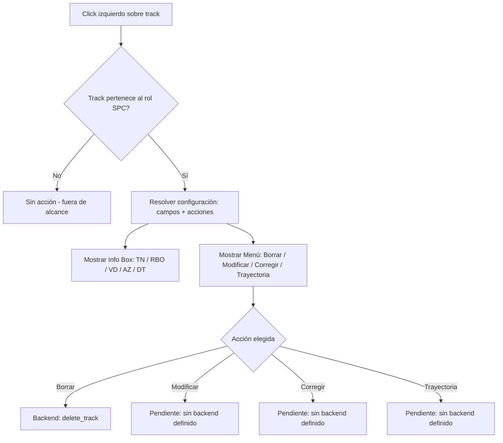

# Especificación Técnica y de Diseño de Software: Data Request

**Proyecto Armagedón — DDM**

**Autor:** MITV Barraza Sebastian
**Última revisión:** 16/07/2026

**Alcance de este documento:** funcional + técnico, a nivel de lógica y diseño de la herramienta. No cubre implementación en C++/Qt — eso queda para un documento de implementación aparte, consumido por Claude Code.

---

## 1. Descripción General y Propósito Táctico

### 1.1 Descripción General

**Data Request** es una herramienta de consulta y operación del DDM que permite al operador acceder a la información resumida de un track detectado en el PPI (Plan Position Indicator) mediante una interacción directa sobre el mismo: **click izquierdo sobre el track**.

Al activarse, la herramienta despliega dos elementos sobre el PPI, ambos anclados a la posición del track seleccionado:

- Un **panel de información (info box)** con los datos tácticos relevantes del track (identificación, rumbo, velocidad, azimut, distancia, y otros campos específicos según el tipo de track).
- Un **menú contextual de acciones** que permite operar sobre ese track (Modificar, Corregir, Iniciar HA, Trayectoria, Borrar), habilitando únicamente las opciones aplicables según el tipo de contacto.

Data Request es una herramienta **de carácter transversal**: no pertenece a un ambiente en particular, sino que está disponible en cualquiera de ellos. Su comportamiento —qué campos muestra y qué acciones habilita— depende del **tipo de track** sobre el que se hace click, no del ambiente desde el que se lo invoca.

Los tracks del sistema se originan desde **ocho roles de guerra legacy** (SPC, LINCO, HECO, APC, ASW, OPS, AAW, EW), cada uno con su propia consola física/virtual de creación y gestión (botonera QEK). En esta primera iteración del documento se contempla exclusivamente el rol **Superficie (SPC)**; los siete roles restantes quedan fuera de alcance y serán incorporados en una revisión posterior.

### 1.2 Propósito Táctico

En el marco del reemplazo del sistema legacy, Data Request cumple la función que en los sistemas de combate navales suele denominarse *track query* o *contact query*: dar al operador una vía rápida y no intrusiva de **identificar y evaluar un contacto** sin necesidad de abandonar su vista operativa principal, y de **iniciar sobre ese contacto acciones tácticas u operativas** (corrección de datos, seguimiento de trayectoria, procedimientos como Hombre al Agua, eliminación del track, etc.).

El valor táctico de la herramienta está en dos puntos:

1. **Inmediatez:** la información crítica del contacto (identificación, cinemática, posición relativa) se obtiene con una sola interacción, sin navegar menús ni paneles separados — relevante en un entorno donde el tiempo de reacción del operador es crítico.
2. **Contextualización por tipo de contacto:** al adaptar tanto los datos mostrados como las acciones disponibles según el rol de guerra que originó el track, se evita sobrecargar al operador con opciones o datos que no aplican a ese contacto — reduciendo la carga cognitiva y el riesgo de error operativo. En esta etapa, dicha contextualización se define exclusivamente para tracks del rol Superficie (SPC).

### 1.3 Alcance del Documento

Este documento cubre la lógica funcional y de diseño de Data Request como herramienta: modelo de datos por rol de guerra, información mostrada, comportamiento del menú de acciones, arquitectura de integración con el PPI compartido, estructuras de datos, flujo de interacción operador-sistema, y manejo de casos de borde. **No cubre** detalles de implementación en C++/Qt — el foco está puesto en la herramienta y su lógica, no en su codificación.

**Alcance de esta iteración:** Data Request se documenta y diseña, en esta primera etapa, exclusivamente para tracks creados dentro del rol de guerra Superficie (SPC), gestionado hoy mediante la botonera legacy QEK correspondiente a ese rol. Los siete roles restantes (LINCO, HECO, APC, ASW, OPS, AAW, EW) quedan fuera de alcance y se incorporarán en revisiones posteriores, una vez validado el comportamiento para SPC.

---

## 2. Modelo de Datos por Tipo de Track

### 2.1 Campo que determina el comportamiento

El sistema clasifica cada track según el **rol de guerra desde el cual fue creado** (campo `Type`, con ocho valores posibles: SPC, LINCO, HECO, APC, ASW, OPS, AAW, EW), cada uno con su propia consola de creación y gestión de tracks (botonera QEK). Esta clasificación es **legacy** y antecede a Data Request.

**Punto ya confirmado:** para esta primera etapa del documento, el único valor contemplado es **SPC (Superficie)**, consistente con el alcance definido en la Sección 1.3.

### 2.2 Información mostrada (info box)

Los cinco campos visibles en la maqueta de referencia corresponden a datos que el sistema ya calcula y mantiene para cada track: identificador, rumbo, velocidad, y la posición relativa del contacto (azimut y distancia) respecto al buque propio.

| Campo | Significado | Estado |
|---|---|---|
| TN | Identificador del track | Disponible |
| RBO | Rumbo del contacto | Disponible |
| VD | Velocidad del contacto | Disponible |
| AZ | Azimut respecto al buque propio | Disponible |
| DT | Distancia respecto al buque propio | Disponible |

Estos cinco campos aplican a cualquier track del rol SPC. No se han definido campos adicionales específicos, ya que el alcance de esta etapa se limita a un único rol de guerra.

### 2.3 Menú de acciones — estado real de cada una

De las cinco acciones del menú contextual, solo una parte tiene funcionalidad equivalente ya construida en el sistema. El resto requiere definición y/o construcción nueva, en algunos casos reutilizando mecanismos legacy ya existentes en la botonera QEK.

| Acción | Estado | Detalle |
|---|---|---|
| **Borrar** | Ya existe | El sistema ya cuenta con una operación de eliminación de track lista para usar (`delete_track`). |
| **Iniciar HA** | Fuera de alcance de esta iteración | El procedimiento de Hombre al Agua ya está implementado en el backend, pero hoy se dispara desde la posición del buque propio, del cursor, o de una coordenada manual — no desde la posición de un track. Cómo se dispara desde Data Request queda sin definir por ahora; no se cubre en esta etapa. |
| **Modificar** | Nueva funcionalidad | **Confirmado:** edición de datos generales del track (rumbo, velocidad, etc.) — no es reasignación de Identidad. No existe operación de backend equivalente todavía. |
| **Corregir** | Nueva funcionalidad | **Confirmado:** distinta del botón `CORRECT` de la botonera QEK. No existe operación de backend equivalente todavía. |
| **Trayectoria** | Nueva funcionalidad | No hay ninguna funcionalidad de trazado o seguimiento de trayectoria en el sistema actual. Es funcionalidad nueva a diseñar desde cero. |

### 2.4 Consecuencia práctica de este hallazgo

Este punto es importante para dimensionar correctamente el alcance de Data Request: **no es una herramienta que simplemente expone en pantalla funcionalidad ya existente.**

Borrar ya existe sin ambigüedad. Modificar, Corregir y Trayectoria son funcionalidad nueva confirmada, sin backend todavía. Iniciar HA existe pero queda fuera de alcance de esta iteración. Esta distinción tiene impacto directo en el esfuerzo y el orden de trabajo del desarrollo, y queda explícita para quien lea este documento sin conocer el estado interno del sistema.

---

## 3. Arquitectura del Software y Descomposición de Módulos

### 3.1 Principio de diseño

Data Request no es un componente aislado: comparte con Fondeo (y con cualquier herramienta futura que interactúe con el PPI) la necesidad de **detectar un click sobre un elemento del radar**. Por eso, el primer principio de arquitectura es: **el mecanismo de detección de click sobre track no debe construirse en exclusividad para Data Request** — debe vivir en un componente común del PPI, reutilizable.

> ⚠️ **Dependencia pendiente:** esta decisión está condicionada a la arquitectura de canvas que ya se dejó abierta en el documento de Fondeo (Canvas / QQuickPaintedItem / MapItemView / custom). Data Request no resuelve esa pregunta — hereda la respuesta que se defina ahí. **Actualización (beta):** para esta primera beta se optó por construir un `PpiCanvas` mínimo y nuevo (ver Anexo, Sección 8) en vez de seguir esperando esa decisión — queda documentado como una implementación de referencia, no como el canvas definitivo del PPI. Un primer intento de esta beta lo colgó como una herramienta más dentro de SUPERFICIE (`ToolsPanel`/`WorkspaceRegistry`) — **incorrecto**, corregido en la Sección 8: el PPI vive en `DDM/shell/`, como panel persistente al lado de la navegación de módulos, no detrás de un menú de herramientas.

### 3.2 Descomposición en módulos funcionales

| Módulo | Responsabilidad |
|---|---|
| **Detector de Click sobre Track** | Componente compartido del PPI. Recibe la posición del click, resuelve si cayó sobre un track y cuál. |
| **Resolver de Configuración por Tipo** | Dado el track detectado, determina su rol de guerra de origen y busca la configuración correspondiente (qué campos mostrar, qué acciones habilitar). En esta etapa, solo existe una entrada de configuración: **SPC**. |
| **Renderer de Info Box** | Dibuja el panel de información sobre el PPI, anclado a la posición del track, con los campos resueltos por el módulo anterior. |
| **Renderer de Menú Contextual** | Dibuja el menú de acciones, mostrando únicamente las habilitadas para ese tipo de track. |
| **Dispatcher de Acciones** | Recibe la acción elegida por el operador y la deriva al flujo correspondiente (backend existente para Borrar; flujos nuevos a definir para Modificar, Corregir, Trayectoria). |

### 3.3 Relación con el backend existente

Es importante que quien lea este documento entienda que **estos módulos son de frontend** — la lógica de negocio real (guardar cambios, calcular trayectoria, etc.) vive en el backend. La Sección 2 ya estableció que:

- **Borrar** ya tiene su contraparte de backend lista para usar.
- **Modificar, Corregir y Trayectoria** no tienen todavía una operación de backend equivalente — el Dispatcher de Acciones, para esas tres, hoy no tendría a dónde derivar la acción. Esto es una dependencia externa a Data Request que debe resolverse antes de la implementación (no es parte del diseño de esta herramienta, sino un prerrequisito).

### 3.4 Contexto dentro de AR-TDC

AR-TDC (la botonera física) integra dos displays de radar en paralelo:

- **`LPDWidget`**: el radar legacy en C++/OpenGL, maneja el protocolo LPD.
- **`DDM QML`** (`QQuickWidget` embebido): carga el proyecto **DDM-UI**.

El PPI sobre el que se diseña Data Request en este documento es el de **DDM-UI** — AR-TDC simplemente lo embebe como panel. Esto confirma que la arquitectura conocida de DDM-UI (`WorkspaceRegistry`, `workspaces/superficie/`, etc.) es el lugar correcto de implementación; no hay que diseñar nada nuevo del lado de AR-TDC para esto.

> ⚠️ **Colisión de nombres a confirmar con el analista:** AR-TDC ya tiene un botón físico llamado `DATA_REQ` en la botonera (zona `CenterZone`, enum `ButtonsData::Center`), sin lógica de negocio implementada todavía — hoy solo actualiza `State` y se codifica como bit en la trama LPD. La herramienta que documenta este archivo es una funcionalidad **distinta**, dentro del PPI de DDM-UI, que comparte nombre por convención pero no está confirmado que deba integrarse con ese botón físico. Recomendado aclarar esto explícitamente para evitar confusión en la implementación.

> ⚠️ **Por confirmar en código:** AR-TDC ya tiene un widget de vista llamado `TracksDetailsWidget` ("Detalles de tracks"). No se pudo determinar por documentación si es el mismo concepto que el Info Box de esta herramienta, uno análogo del lado legacy (`LPDWidget`/OpenGL), o algo no relacionado. **Resuelto en el relevamiento de la beta:** es un overlay `QGraphicsWidget` del lado legacy OpenGL (`ClickableTrackAIS`/`TracksWidget`), un subsistema distinto de DDM-UI QML. No se reutiliza código; es un concepto análogo, no el mismo componente.

> ⚠️ **Precondición operativa confirmada en código (agregado en la beta):** Data Request vive dentro de DDM-UI QML, y DDM-UI **solo es visible en AR-TDC cuando el botón físico EMERG está activado**. `MainWindowSimple::on_EMERG_toggled` / `MainWindowDual::on_EMERG_toggled` (`src/view/mainWindowSimple.cpp:604`, `src/view/mainWindowDual.cpp:178`) son el único punto donde se decide qué widget muestra `stackedAND`: con EMERG activo, se ve `m_ddmContainer` (el `QQuickWidget` que carga todo DDM-UI, incluido el PPI de Data Request); con EMERG apagado, se ve la vista legacy. Esto no es una falla de la herramienta ni algo que Data Request deba resolver — es una condición de la botonera física que debe quedar clara para cualquiera que pruebe o dé soporte a esta herramienta. El estado interno de Data Request (track seleccionado, panel abierto) sobrevive a togglear EMERG, porque `setCurrentWidget` solo cambia qué widget se ve, no destruye el `QQuickWidget`.

---

## 4. Diseño de Estructuras de Datos y Motor Computacional

### 4.1 Por qué esta sección es más liviana que en Fondeo

A diferencia de Fondeo, **Data Request no calcula nada nuevo**: los cinco campos del info box (TN, RBO, VD, AZ, DT) ya están calculados y disponibles en el sistema para cualquier track. Data Request los **lee y presenta**, no los produce. Por eso no hay un "motor de cálculo" propio — hay, en cambio, una estructura de **resolución de configuración**.

### 4.2 Estructura conceptual: Configuración por Tipo de Track

Se necesita una tabla de configuración (no una fórmula) que relacione tipo de track → campos a mostrar → acciones habilitadas. Conceptualmente:

| Tipo de track | Campos del info box | Acciones habilitadas |
|---|---|---|
| SPC | TN, RBO, VD, AZ, DT | Borrar, Modificar, Corregir, Trayectoria |
| *(resto de los roles)* | *fuera de alcance* | *fuera de alcance* |

Esta tabla es la pieza central del diseño: agregar un nuevo rol en el futuro (por ejemplo AAW) debería significar **agregar una fila**, no reescribir el mecanismo de detección ni de renderizado.

### 4.3 Estructura conceptual: Selección Activa

Mientras el info box y el menú están abiertos, el sistema necesita recordar sobre qué track se está operando. Conceptualmente, esto requiere un estado de "selección activa" con, como mínimo:

- Identificador del track seleccionado.
- Configuración resuelta para ese track (la fila de la tabla anterior).
- Estado del menú (abierto/cerrado).

### 4.4 Pendiente para Modificar y Corregir

Como estas dos acciones aún no tienen definición funcional completa, sus estructuras de datos (qué campos son editables, qué formato tiene una "corrección") **no se pueden diseñar todavía**. Quedan explícitamente marcadas como deuda de definición en la Sección 6.

---

## 5. Dinámica de Operación y Flujos de Datos

### 5.1 Flujo principal

### 5.2 Paso a paso

1. El operador hace click izquierdo sobre un track visible en el PPI.
2. El Detector de Click identifica el track y lo pasa al Resolver de Configuración.
3. El Resolver verifica el rol de origen del track. Si **no es SPC**, no se despliega nada — Data Request no actúa fuera de su alcance actual.
4. Si es SPC, el Resolver entrega la configuración (campos + acciones) a los dos renderers, que dibujan Info Box y Menú en simultáneo, anclados a la posición del track.
5. El operador elige una acción. El Dispatcher la deriva:
   - **Borrar** → tiene camino claro hacia el backend existente.
   - **Modificar, Corregir, Trayectoria** → el Dispatcher no tiene, hoy, un destino definido. Esto debe resolverse antes de implementar estas tres opciones.

> ⚠️ **Pendiente de definir:** si el Info Box debe actualizarse en vivo mientras está abierto (por ejemplo, si el track sigue moviéndose) o si muestra una foto fija tomada en el momento del click. **Resuelto en la beta:** se optó por actualización en vivo (bindeado directo contra `tracksList`), porque esa lista ya se repollea sola cada ~3s en todo el sistema — es más simple bindear y filtrar que tomar una instantánea aparte.

---

## 6. Robustez, Casos de Borde y Manejo de Errores

| Caso | Comportamiento esperado |
|---|---|
| El track desaparece (se pierde o lo borra otro operador) mientras el Info Box/Menú están abiertos | Cerrar automáticamente ambos elementos y no dejar acciones huérfanas apuntando a un track inexistente. **Implementado en la beta**: `DataRequestViewModel.closeIfTrackMissing()`. |
| Click ambiguo entre dos tracks superpuestos | Pendiente de definir criterio de desempate (¿el más cercano al centro del click? ¿el de mayor prioridad de identidad?). **Heurística provisoria de la beta**: gana el track dibujado más cercano al punto de click, sin doctrina validada detrás. |
| Click sobre un track que no es SPC | No se despliega nada, sin mensaje de error visible — es un comportamiento esperado de esta iteración, no una falla. |
| Dos operadores intentan accionar sobre el mismo track a la vez (ej. uno lo borra mientras otro tiene el menú abierto) | Pendiente — depende de cómo el backend notifique cambios de estado al frontend; no está definido en este documento. |
| Operador selecciona Modificar, Corregir o Trayectoria | Como no existe backend para estas tres, el sistema debería, como mínimo, comunicar claramente que la acción no está disponible todavía — no fallar en silencio. **Implementado en la beta**: banner temporal con el motivo. |
| Operador selecciona un track y luego se mueve fuera del alcance del PPI (scroll, zoom, cambio de vista) | Pendiente de definir si el Info Box sigue al track o se cierra. No aplica todavía en la beta (el `PpiCanvas` no tiene pan/zoom). |

---

## 7. Ambigüedades y Dependencias Pendientes (resumen)

Lista consolidada de todo lo que este documento deja explícitamente sin resolver, para facilitar el seguimiento:

1. **Arquitectura de canvas del PPI** (Canvas / QQuickPaintedItem / MapItemView / custom) — heredada de la definición pendiente en el documento de Fondeo. La beta construyó un `PpiCanvas` propio como solución de referencia, no como decisión final.
2. **Criterio de desempate en clicks ambiguos** entre tracks superpuestos.
3. **Backend faltante** para Modificar, Corregir y Trayectoria — sin esto, Data Request no puede implementar 3 de sus 5 acciones.
4. **Disparador real de "Iniciar HA" desde Data Request** — queda fuera de alcance de esta iteración; el backend actual no soporta "posición de track" como trigger.
5. **Colisión de nombre con el botón físico `DATA_REQ`** de la botonera AR-TDC (zona Center) — confirmar con el analista si deben integrarse o son funcionalidades independientes.
6. **`TracksDetailsWidget` de AR-TDC** — confirmado que es un concepto análogo del lado legacy, no el mismo componente (ver Sección 3.4).
7. **Actualización en vivo vs. foto fija** del Info Box — resuelto para la beta (vivo), ver Sección 5.1.
8. **Manejo de concurrencia** entre operadores accionando sobre el mismo track.
9. **Comportamiento del Info Box ante scroll/zoom/cambio de vista** del PPI — no aplica todavía (sin pan/zoom en la beta).
10. ~~Que Data Request sea un overlay transversal real~~ — **resuelto en la beta** (ver Anexo, Sección 8.4): el PPI pasó a ser un panel persistente del shell, no una herramienta de SUPERFICIE.

---

## 8. Anexo: Estado de implementación (beta)

Esta sección documenta lo que se construyó como beta funcional (no oficial, con errores esperables) a partir de este documento, y en qué difiere del diseño ideal descripto arriba.

### 8.1 Alcance de la beta

Implementado: PPI mínimo con click funcional, resolución de configuración por tipo (solo SPC), Info Box en vivo, menú de las 5 acciones (solo Borrar funcional, el resto deshabilitadas con motivo visible), cierre automático si el track desaparece, desempate simple por cercanía en clicks ambiguos, y panel transversal (ver 8.4).

No implementado (deuda, no bug): backend de Modificar/Corregir/Trayectoria, disparo de Iniciar HA desde un track, roles distintos de SPC, concurrencia entre operadores, pan/zoom del PPI.

**Primer intento descartado:** la primera versión de esta beta colgó el PPI como una herramienta más navegable dentro de SUPERFICIE (un `PpiWorkspace.qml` registrado en `WorkspaceRegistry`, cargado por el `Loader` de `ToolsPanel` solo cuando el operador lo seleccionaba del menú de herramientas). Comparado contra la maqueta Figma de referencia, esto estaba mal: Data Request tiene que verse como el PPI principal, en simultáneo con la navegación de módulos — no escondido detrás de una selección de herramienta. Corregido según 8.2/8.4.

### 8.2 Componentes nuevos (DDM-UI QML, repo `tdc-botonera/botonera`)

| Archivo | Rol |
|---|---|
| `DDM/core/DataRequestConfig.qml` | Tabla de configuración por tipo de track (Sección 4.2). Singleton, mismo patrón que `WorkspaceRegistry`. |
| `DDM/components/display/PpiCanvas.qml` | Detector de Click sobre Track + render mínimo del PPI (Sección 3.2). Dibuja buque propio y tracks proyectando azimut/distancia; hit-testing por cercanía. |
| `DDM/shell/datarequest/DataRequestViewModel.qml` | Selección Activa (Sección 4.3) + Dispatcher de Acciones (Sección 3.2). |
| `DDM/shell/datarequest/InfoBoxPanel.qml` | Renderer de Info Box. |
| `DDM/shell/datarequest/ActionMenuPanel.qml` | Renderer de Menú Contextual. |
| `DDM/shell/PpiPanel.qml` | Integra los anteriores, reutiliza el flujo de confirmación de Borrar de `SitrepWorkspace.qml` contra `BackendService.deleteTrack`. Vive en `shell/` (no en `workspaces/superficie/`) porque no es una herramienta de un rol — ver 8.4. |

Dado de alta en `DDM/qmldir` y `DDM.qrc`. **No** está registrado en `WorkspaceRegistry` — a propósito, ver 8.4.

### 8.3 Reutilización confirmada (sin trabajo de backend nuevo, sin tocar C++)

- Los 5 campos del info box ya viajaban en `BackendService.tracksList` (`id`, `azimut`/`azimutNum`, `distancia`/`distanciaNum`, `rumbo`/`rumboNum`, `velocidad`/`velocidadNum`, `environment`) — sin necesidad de ningún comando JSON nuevo.
- Borrar reutiliza tal cual la cadena existente: `BackendService.deleteTrack(trackId)` → `DDMController::deleteTrack` → JSON `delete_track` → `TrackCommandHandler::deleteTrack` → `TrackService::deleteTrackById` → `CommandContext::eraseTrackById`.
- La visibilidad completa de Data Request (mostrarse/ocultarse) la resuelve gratis el propio botón EMERG ya existente en AR-TDC (`MainWindowSimple`/`MainWindowDual::on_EMERG_toggled`, `stackedAND->setCurrentWidget`) — no hizo falta escribir ni un línea de C++ nueva. Se evaluó (y se descartó) inyectar los tracks DDM en el pipeline legacy del `LPDWidget` (`NMEARepository`/`TrackRadarEntity`/`ClickableTrackAIS`) para que aparecieran sobre el radar OpenGL real; se optó en cambio por un PPI propio en QML, más simple y sin riesgo de interferir con contactos de radar reales.

### 8.4 Arquitectura de shell (resuelto en esta beta)

Antes: la navegación de DDM-UI (`DDMContent/main.qml`) era un `StackView` de pantalla completa que apilaba `ControlModulePanel` y `ToolsPanel`, y `ToolsPanel` cargaba un único workspace a la vez vía `Loader` + `WorkspaceRegistry` — no había forma de mostrar algo "por encima" de esa navegación.

Ahora: `main.qml` reparte la pantalla en dos columnas con un `RowLayout` — `PpiPanel` (nuevo, ver 8.2) a la izquierda, ocupando el PPI/Data Request, y el mismo `StackView` de siempre (sin cambios internos: `ControlModulePanel`/`ToolsPanel` siguen funcionando exactamente igual) a la derecha. Como `PpiPanel` es un hermano persistente del `StackView` y no pasa por `WorkspaceRegistry`, Data Request queda visible sin importar qué módulo/herramienta esté seleccionado del lado derecho — transversal, tal como lo pedía la Sección 1.1. Esto se ve (y deja de verse) exactamente cuando EMERG se activa/desactiva en AR-TDC, sin lógica adicional: es simplemente parte del contenido que `stackedAND` muestra u oculta.

---

## Documentos Relacionados

- `docs/flows/fondeo.md` — módulo de Fondeo (referencia de patrón para herramientas del PPI).
- Backend DDM: `docs/architecture.md`, `docs/modules/entities.md`, `docs/reference/enums.md`, `docs/protocols/json-command-api.md`, `docs/flows/track-lifecycle.md`, `docs/flows/hombre-al-agua.md`.
- AR-TDC (botonera): `docs/architecture.md`, `docs/modules/button-zones.md`, `docs/modules/view.md`.
