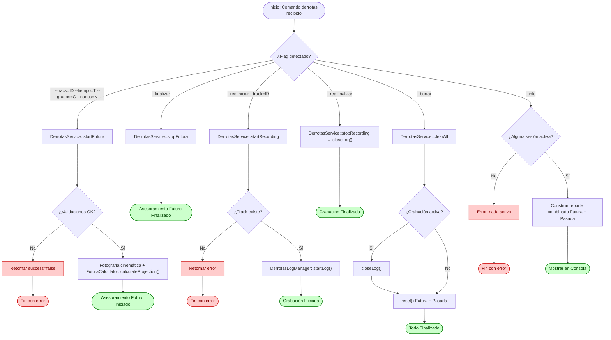
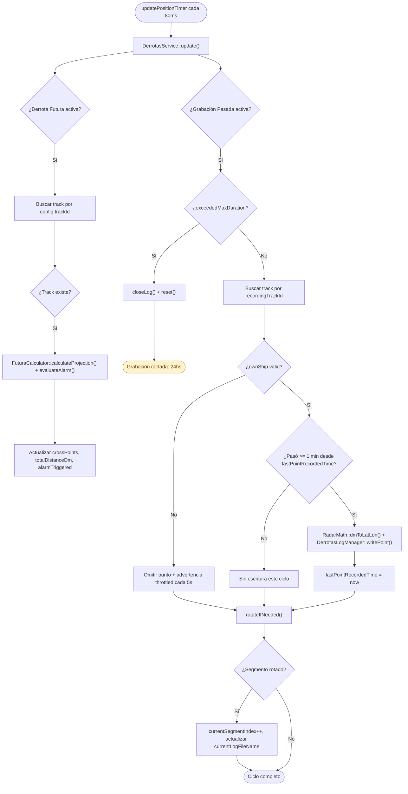

# Flujo: Derrotas (Futuras y Pasadas)

## Descripción general

Este flujo documenta la gestión de dos funcionalidades tácticas independientes agrupadas bajo el módulo **Derrotas**: la proyección de **Derrota Futura** de un track de interés, con alarma táctica asociada, y la **grabación de Derrota Pasada**, que persiste en disco la posición histórica de un track a intervalos regulares. Ambas comparten el mismo comando de entrada (`derrotas`) y el mismo `DerrotasSessionState`, pero operan sobre ciclos de vida completamente desacoplados y pueden estar activas en simultáneo, incluso sobre tracks distintos.

En **Derrota Futura**, dado un track, un tiempo de proyección (5, 10, 30 o 60 minutos) y dos umbrales de tolerancia (grados y nudos), el sistema calcula diez puntos equidistantes a lo largo del rumbo proyectado y evalúa de forma continua si el track se desvía de su rumbo o velocidad iniciales más allá de los umbrales configurados, exponiendo un indicador booleano de alarma (`alarmTriggered`).

En **Derrota Pasada**, dado un track, el sistema graba su posición geográfica, rumbo y velocidad en archivos log segmentados sobre disco, a razón de un punto por minuto, con rotación de archivo cada 15 minutos y corte automático a las 24 horas.

> **Nota de alcance**: la función de cargar un log ya grabado y representarlo gráficamente sobre la LPD (incluyendo la detección de Way Points por cambio de rumbo) fue delegada a un programa externo con cartas náuticas propias. Este módulo implementa exclusivamente el cálculo de la proyección futura, la evaluación de la alarma y la escritura del registro histórico; no implementa lectura de logs ya grabados ni ningún elemento de interfaz gráfica (incluida la animación de parpadeo de la alarma sobre la LPD).
>

---

## Lista de archivos y clases

| Archivo | Clase/Struct | Responsabilidad |
|---|---|---|
| `src/controller/commands/derrotasCommand.cpp` | `DerrotasCommand` | Entrada CLI para iniciar Derrota Futura (`--track`, `--tiempo`, `--grados`, `--nudos`), finalizarla (`--finalizar`), iniciar/finalizar la grabación (`--rec-iniciar`, `--rec-finalizar`), cortar todo (`--borrar`) y consultar (`--info`). |
| `src/controller/services/derrotasService.cpp` | `DerrotasService` | Orquestador de ambos casos de uso (start/stop de Futura, start/stop de grabación), validación de negocio e integrador con el bucle de actualización. Mantiene como miembro propio la única instancia de `DerrotasLogManager`. |
| `src/model/derrotas/futuraCalculator.cpp` | `FuturaCalculator` | Motor matemático puro encargado de la proyección de las diez cruces y la evaluación de la alarma táctica. |
| `src/model/derrotas/derrotasLogManager.cpp` | `DerrotasLogManager` | Encapsula la escritura y segmentación de los archivos log en disco de una grabación. Solo implementa el camino de escritura; los métodos de lectura (`loadLog`/`loadLogs`) están comentados por quedar fuera de alcance. |
| `src/model/derrotas/pasadaCalculator.h` | `DerrotasLogPoint` | Struct que representa un punto grabado (nombre, fecha/hora, latitud, longitud, RV, VD), consumido por `DerrotasLogManager::writePoint`. La clase `PasadaCalculator` (lectura/graficado) está comentada por la misma razón de alcance. |
| `src/model/derrotas/derrotasSessionState.h` | `DerrotasSessionState`, `DerrotasFuturaState`, `DerrotasPasadaState`, `DerrotasFuturaConfig` | Estructuras de datos que persisten el estado dinámico de ambos ciclos de vida. |
| `src/model/utils/RadarMath.cpp` | `RadarMath::dmToLatLon` | Conversión geográfica inversa a `latLonToDm`, agregada específicamente para poder grabar la coordenada real de un track en el log de Derrota Pasada. |
| `src/model/commandContext.h` | `CommandContext` | Contenedor global que aloja la sesión activa `derrotasSession` dentro del pipeline del sistema. |

---

## Clases principales

### DerrotasCommand

- **Rol**: Wrapper CLI encargado exclusivamente del análisis sintáctico de tokens. No contiene reglas de negocio: delega toda validación y ejecución a `DerrotasService`, devolviendo directamente el `DerrotasOperationResult` recibido.

- **Métodos clave**:

| Método | Firma | Descripción |
|---|---|---|
| Ejecutar | `CommandResult execute(const CommandInvocation& inv, CommandContext& ctx) const` | Modula entre los seis modos operativos (`--info`, `--borrar`, `--rec-iniciar`, `--rec-finalizar`, `--finalizar`, o inicialización de Derrota Futura). |

- **Decisión de diseño — instancia compartida**: a diferencia de `TwoWCommand`/`FondeoCommand`, que instancian su propio Service de forma efímera en cada `execute()`, `DerrotasCommand` recibe un puntero `DerrotasService*` por constructor — el mismo patrón que `HaCommand` aplica con `ObmService`. Esto es necesario porque `DerrotasService` mantiene estado con recursos vivos (`DerrotasLogManager` con un `QFile` abierto durante una grabación); una instancia efímera por comando cerraría el archivo al destruirse al final de cada `execute()`, dejando al bucle de 80ms escribiendo sobre una instancia distinta que nunca abrió ningún archivo.

- **Validación en CLI**: limitada a la presencia de parámetros obligatorios y a la conversión de tipos primitivos (`toInt`, `toDouble`). Las reglas de negocio (existencia del track, pertenencia de tiempo/umbrales a los conjuntos de valores fijos) se resuelven en `DerrotasService`.

### DerrotasService

- **Rol**: Orquestador de ambos casos de uso. Centraliza las reglas de validación de negocio (existencia del track, pertenencia de tiempo y umbrales a los conjuntos de valores fijos de la interfaz) y resuelve el sub-estado de sesión correspondiente. Todos los métodos públicos de operación devuelven una estructura uniforme.

- **Struct de resultado**:

```cpp
struct DerrotasOperationResult {
    bool success = false;
    QString message;
};
```

- **Métodos clave**:

| Método | Firma | Descripción |
|---|---|---|
| Iniciar Futura | `DerrotasOperationResult startFutura(int trackId, int timeMinutes, double thresholdDeg, double thresholdKn)` | Valida que no haya sesión futura activa, que el track exista y que tiempo/umbrales pertenezcan a sus conjuntos fijos. Toma la fotografía cinemática inicial e invoca `FuturaCalculator::calculateProjection`. |
| Finalizar Futura | `DerrotasOperationResult stopFutura()` | Valida sesión activa y llama `reset()` sobre `DerrotasFuturaState`. |
| Iniciar Grabación | `DerrotasOperationResult startRecording(int trackId)` | Valida que no haya grabación activa y que el track exista; invoca `DerrotasLogManager::startLog()`. |
| Finalizar Grabación | `DerrotasOperationResult stopRecording()` | Cierra el archivo (`closeLog()`) y llama `reset()` sobre `DerrotasPasadaState`. |
| Borrar Todo | `DerrotasOperationResult clearAll()` | Corta ambos ciclos de vida en una única operación, cerrando primero el archivo en escritura si corresponde. |
| Actualización | `void update()` | Recalcula la proyección/alarma de Futura y gestiona la escritura throttled, la segmentación y el corte por duración de Pasada. |

### FuturaCalculator

- **Rol**: Motor de cómputo puro y sin estado interno, encargado de la Derrota Futura. No conoce `CommandContext` ni el pool de tracks; recibe tipos primitivos y estructuras geométricas por valor y devuelve resultados por referencia.

- **Métodos clave**:

| Método | Firma | Descripción |
|---|---|---|
| Proyección | `static void calculateProjection(QPointF trackPos, double trackCourseDeg, double trackSpeedKn, int timeMinutes, QList<QPointF>& out_crossPoints, double& out_totalDistanceDm)` | Calcula la distancia total (V×T convertida a DM) y la fracciona en diez puntos equidistantes sobre el rumbo del track. |
| Evaluación de alarma | `static bool evaluateAlarm(double baseCourseDeg, double baseSpeedKn, double currentCourseDeg, double currentSpeedKn, double thresholdDeg, double thresholdKn)` | Compara el estado actual contra la fotografía cinemática base con lógica OR entre desvío de rumbo y desvío de velocidad. |

- **Consideraciones técnicas del motor**:
  - **Conversión de unidades**: factor constante `1 NM = 1.012685 DM`, consistente con el resto del sistema.
  - **Normalización angular**: el desvío de rumbo se normaliza al camino más corto en el rango `(-180°, 180°]` antes de compararlo contra el umbral, evitando falsos positivos en el salto 360°→0°.
  - **Comparación estricta**: ambos desvíos (grados y nudos) se evalúan con `>` estricto, no `>=` — el valor exacto del umbral no dispara la alarma.

### DerrotasLogManager

- **Rol**: Encapsula el ciclo de vida del archivo de log de una grabación (creación, escritura, rotación por tiempo, cierre). Implementa únicamente el camino de escritura; `loadLog`/`loadLogs` fueron desarrollados y luego comentados al confirmarse que la carga/graficado de derrotas pasadas queda fuera de este alcance.

- **Métodos clave**:

| Método | Firma | Descripción |
|---|---|---|
| Iniciar log | `bool startLog(int trackId, const QDateTime& startTime, int segmentMinutes)` | Crea el directorio si no existe y abre un archivo nuevo con el encabezado de columnas. |
| Escribir punto | `bool writePoint(const DerrotasLogPoint& point)` | Agrega una línea al archivo actualmente abierto; no-op si no hay archivo abierto. |
| Rotar segmento | `bool rotateIfNeeded(const QDateTime& now)` | Si transcurrió `segmentMinutes` desde el inicio del segmento actual, cierra el archivo y abre uno nuevo con timestamp propio. |
| Cerrar log | `void closeLog()` | Cierra el archivo actual, si existe uno abierto. |
| Corte por duración | `bool exceededMaxDuration(const QDateTime& now) const` | Verdadero si transcurrieron 24 horas desde el inicio de la grabación. |

- **Consideraciones técnicas**:
  - **Nombre de archivo**: formato `tn0001_14-32-07.txt` — el separador de hora usa guiones en lugar de dos puntos, dado que estos últimos no son válidos en nombres de archivo sobre Windows.
  - **Columnas**: `Nombre  FechaHora  Latitud  Longitud  RV  VD`, separadas por tabulación; fecha/hora en formato `ddMMyy HH:mm:ss`.
  - **Directorio**: `./derrotas`, relativo al directorio de trabajo del ejecutable.

### RadarMath::dmToLatLon (conversión geográfica)

- **Rol**: Función utilitaria que resuelve la conversión de la posición DM de un track a coordenada geográfica real, para poder grabarla en el log de Derrota Pasada.
- **Firma**: `static void dmToLatLon(double originLat, double originLon, double xDm, double yDm, double& outTargetLat, double& outTargetLon)`
- **Método**: inversa algebraica de `latLonToDm`, usando las mismas constantes de escala (111.320 m/grado, 1.828,8 m/DM); incluye una protección ante latitudes cercanas a los polos, donde el coseno de la latitud tiende a cero — en ese caso extremo, la longitud de destino se devuelve sin modificar.
- **Dependencia de origen**: como origen se utiliza la geo-posición actual del Buque Propio (`ctx->ownShip.latitudeDeg/longitudeDeg`), mismo criterio que usa `RadarMath::latLonToDm` en HA y Fondeo. Esta solución asume que la posición DM del track (`x`, `y`) es relativa al mismo origen que ancla al Buque Propio en `(0,0)` — válido en modo `RELATIVE` (ver nota equivalente en `docs/flows/hombre-al-agua.md`), no verificado en modo `TRUE_MOTION`.

---

## Flujo de datos (Ciclo de Vida del Comando)



### Flujo CLI (Paso a Paso) — Derrota Futura

```bash
derrotas --track=<id> --tiempo=<5|10|30|60> --grados=<deg> --nudos=<kn>
```

1. `DerrotasCommand::execute` procesa los argumentos en un mapa local de opciones, normalizando claves a minúsculas y removiendo guiones iniciales.
2. El comando valida únicamente la presencia de los cuatro parámetros y la conversión a tipos primitivos.
3. Se invoca `DerrotasService::startFutura()`, que valida que no exista ya un asesoramiento activo, que el track exista, y que tiempo/grados/nudos pertenezcan a sus conjuntos fijos (5/10/30/60; 10/30/45/90/150/180; 2/5/10/20/50/100). Si todas las validaciones pasan, toma la fotografía cinemática base y fija el sub-estado como activo.

### Flujo CLI (Paso a Paso) — Derrota Pasada (Grabación)

```bash
derrotas --rec-iniciar --track=<id>
derrotas --rec-finalizar
```

1. `startRecording()` valida que no haya grabación activa y que el track exista.
2. Invoca `DerrotasLogManager::startLog()`, que crea el directorio `./derrotas` si no existe y abre el archivo con el encabezado de columnas.
3. El sub-estado `DerrotasPasadaState` queda activo; a partir de este momento, el bucle de 80ms toma el control de la escritura periódica.
4. `--rec-finalizar` cierra el archivo actual y restaura el sub-estado.

---

### Ciclo de Recálculo Continuo (Bucle Activo)

A diferencia de otros comandos puntuales, ambas funcionalidades se evalúan de manera continua en el bucle principal de la aplicación (`main.cpp`), mediante la misma instancia persistente de `DerrotasService` compartida con `DerrotasCommand`:



> **Nota sobre el throttle de grabación**: de los aproximadamente 750 ciclos de 80ms que ocurren en un minuto, únicamente el primero que cumple `lastPointRecordedTime.secsTo(now) >= 60` efectivamente escribe al archivo. `rotateIfNeeded()` en cambio se evalúa en **todos** los ciclos, de forma independiente al throttle de escritura — la rotación por tiempo no depende de que se haya grabado un punto en ese ciclo.

---

## Estructuras de Datos Clave

### Configuración de Derrota Futura (`DerrotasFuturaConfig`)

Estructura inmutable durante la sesión, fijada al invocar `startFutura()`:

- `trackId`, `timeMinutes` (5/10/30/60), `thresholdDeg` (10/30/45/90/150/180), `thresholdKn` (2/5/10/20/50/100).

### Estado de Sesión — Derrota Futura (`DerrotasFuturaState`)

- **Control**: `active`, `config` (instancia de `DerrotasFuturaConfig`).
- **Fotografía cinemática (I2)**: `baseCourseDeg`, `baseSpeedKn` — ancla de comparación para la alarma, tomada al iniciar.
- **Resultado dinámico**: `alarmTriggered`, `crossPoints` (las diez cruces, recalculadas cada 80ms), `totalDistanceDm`.

### Estado de Sesión — Derrota Pasada (`DerrotasPasadaState`)

- **Control**: `recordingActive`, `recordingTrackId`, `recordingStartTime`.
- **Segmentación**: `currentLogFileName`, `currentSegmentIndex`.
- **Throttle de escritura**: `lastPointRecordedTime` — último instante en que se grabó un punto; controla el intervalo mínimo de 1 minuto entre escrituras.

Ambos sub-estados exponen `reset()` de forma independiente; `DerrotasSessionState::reset()` invoca ambos sin que se afecten entre sí.

### Punto de Log (`DerrotasLogPoint`)

Struct que representa un renglón del archivo grabado: `trackName`, `timestamp`, `latDeg`, `lonDeg`, `rvDeg`, `vdKn`.

---

## Manejo de Errores y Casos de Borde

- **Track inexistente**: tanto `startFutura()` como `startRecording()` verifican la existencia del track mediante `findTrackById()` antes de cualquier otra operación.
- **Valores fuera del conjunto fijo**: tiempo, umbral de grados y umbral de nudos se validan contra listas cerradas de valores coincidentes con los controles predefinidos de la interfaz. Cualquier otro valor numérico es rechazado, incluso si es matemáticamente válido.
- **Sesión duplicada**: a diferencia de HA (que sobrescribe la sesión anterior con `reset()` implícito) o Fondeo (que la rechaza igual que Derrotas), invocar `startFutura()` o `startRecording()` con una sesión ya activa del mismo tipo es rechazado explícitamente, exigiendo una finalización manual previa en ambos ciclos de vida.
- **Buque Propio sin geolocalización válida**: durante una grabación activa, si `ctx->ownShip.valid` es falso, el punto correspondiente a ese ciclo se omite por completo — no se escribe con coordenadas en `(0.0, 0.0)` ni con ningún valor de relleno. La grabación permanece activa y continúa intentando escribir en los ciclos siguientes; la advertencia por consola está limitada a un máximo de una vez cada 5 segundos para no saturar la salida.
- **Corte automático a las 24 horas**: una grabación sin finalización manual se corta automáticamente al alcanzar las 24 horas desde su inicio, cerrando el archivo y restaurando el estado.
- **Instancia compartida del servicio**: `DerrotasCommand` no instancia su propio `DerrotasService`; recibe por constructor el puntero a la instancia persistente registrada en `main.cpp` y conectada al temporizador de 80ms, garantizando que el `DerrotasLogManager` — y por lo tanto el archivo abierto durante una grabación — sea el mismo objeto a lo largo de todo el ciclo de vida de la sesión, sin importar cuántos comandos de consola se ejecuten mientras tanto.
- **Alcance de la grabación (track seleccionado vs. Buque Propio)**: se evaluó restringir `startRecording()` exclusivamente al Track 0 (Buque Propio), pero se optó por mantener la implementación original, que permite grabar cualquier track seleccionado por el operador — consistente con el documento de análisis operativo, que no restringe la selección al BP en ningún punto de la Sección B. La restricción queda disponible como cambio de bajo costo para una futura iteración si se confirma esa doctrina.

---

## Módulos Relacionados

- `src/model/commandContext.h` — Estructura general de ejecución.
- `docs/flows/hombre-al-agua.md` — Referencia de la nota de dependencia de modo `RELATIVE` para conversiones geográficas basadas en el origen del Buque Propio.
- `docs/flows/fondeo.md` — Pipeline homólogo con sesión rechazada (no sobrescrita) ante un segundo inicio.
- `docs/flows/2w.md` — Pipeline homólogo de recálculo continuo cada 80ms.