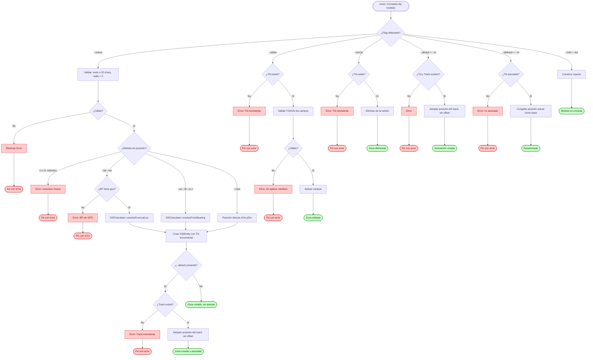
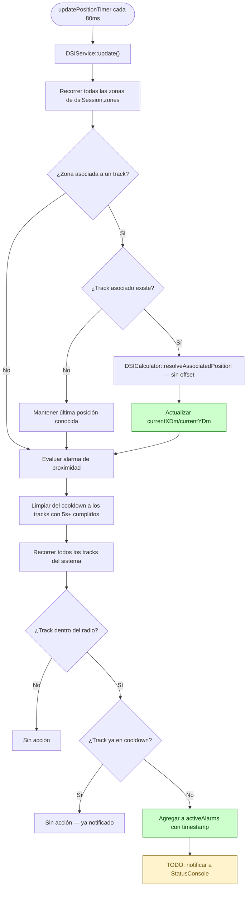

# Flujo: Módulo DSI (Distancia de Seguridad Impuesta)

## Descripción general

Este flujo documenta la gestión de zonas circulares de alerta sobre la pantalla del radar LPD. Cada zona combina un texto identificatorio (hasta 20 caracteres), un formato visual configurable (radio, estilo de línea, color y fondo del rótulo) y una posición sobre el plano táctico.

A diferencia de una anotación estática, la finalidad principal de DSI es de vigilancia activa: el sistema evalúa en forma continua la posición de todos los tracks del radar contra el radio de cada zona, y notifica al operador cuando un track ingresa a ella.

DSI no tiene límite máximo de instancias simultáneas, el operador es responsable de gestionar la cantidad de zonas en pantalla según su criterio operativo. Una zona puede permanecer estática en el punto donde fue creada, o asociarse dinámicamente a un track del radar para acompañar su movimiento.

---

## Lista de archivos y clases

| Archivo | Clase/Struct | Responsabilidad |
|---|---|---|
| `src/controller/commands/dsiCommand.cpp` | `DSICommand` | Entrada CLI para pruebas manuales: crear, editar, borrar, asociar/desasociar, consultar. |
| `src/controller/services/dsiService.cpp` | `DSIService` | Orquestador del ciclo de vida completo de las zonas, evaluación de la alarma de proximidad, e integrador con el bucle de actualización. |
| `src/model/dsi/dsiCalculator.cpp` | `DSICalculator` | Motor matemático puro: resuelve posición inicial (Sección B), adopción directa de posición (Sección C) y chequeo geométrico de proximidad. |
| `src/model/dsi/dsiEntity.h` | `DSIEntity` | Entidad de datos de una zona individual. Contenido, formato, posición, asociación y estado de alarma. |
| `src/model/dsi/dsiSessionState.h` | `DSISessionState` | Contenedor de sesión — lista dinámica de `DSIEntity`, sin límite fijo. |
| `src/model/commandContext.h` | `CommandContext` | Contenedor global que aloja `dsiSession` dentro del pipeline del sistema. |

---

## Clases principales

### DSICommand

- **Rol**: Wrapper CLI para pruebas manuales. El camino real del operador es exclusivamente gráfico (botonera). Este comando existe solo para testing y verificación durante el desarrollo. No está conectado a `JsonCommandHandler`.
- **Comandos soportados**:

| Comando | Descripción |
|---|---|
| `dsi --nuevo [--texto=<str>] [--radio=<mn>] [--estilo=<e>] [--color=<c>] [--fondo=<c>] (--man=<x>,<y> \| --az=<g> --dt=<mn> (--v\|--r) \| --lat=<g>,<m>,<s> --lon=<g>,<m>,<s>) [--altrack=<tn>]` | Crea una zona nueva. |
| `dsi --editar=<tn> [--texto=<str>] [--radio=<mn>] [--estilo=<e>] [--color=<c>] [--fondo=<c>]` | Edita una zona existente (uno o más campos, aplicados de forma atómica). |
| `dsi --borrar=<tn>` | Elimina una zona. |
| `dsi --altrack=<trackId> --tn=<tn>` | Asocia una zona existente a un track. |
| `dsi --deltrack --tn=<tn>` | Desasocia una zona de su track. |
| `dsi --info=<tn>` | Muestra el detalle completo de una zona. |
| `dsi --list` | Lista todas las zonas activas. |

- **Reglas de validación CLI**:
  - `--texto` no puede superar los 20 caracteres.
  - `--radio` debe ser mayor a 0.
  - Los tres métodos de posición (`--man`, `--az`/`--dt`, `--lat`/`--lon`) son mutuamente excluyentes, exactamente uno por zona. A diferencia de Texto, no existe un cuarto método `--deltrack` como posición inicial (el seguimiento de track vive solo en `--altrack`/`--deltrack` de Sección C).
  - `--az` requiere `--dt` y exactamente uno de `--v` (Verdadero) o `--r` (Relativo).
  - `--lat`/`--lon` se ingresan en formato GMS (`grados,minutos,segundos`) y se convierten con `RadarMath::dmsToDecimal`.

### DSIService

- **Rol**: Coordinador del ciclo de vida completo de las zonas. No tiene límite de instancias, genera un TN incremental propio por cada zona nueva (independiente de cualquier Track Number real).
- **Métodos clave**:

| Método | Firma | Descripción |
|---|---|---|
| Crear | `DSIOperationResult createDSI(const DSICreateParams& params)` | Valida y resuelve la posición según el método de la Sección B, crea el `DSIEntity` y lo agrega a la sesión. |
| Editar | `DSIOperationResult editDSI(int tn, const QMap<QString, QString>& fields)` | Modifica campos de una zona existente, de forma atómica. |
| Borrar | `DSIOperationResult deleteDSI(int tn)` | Elimina una zona de la sesión. |
| Asociar | `DSIOperationResult associateTrack(int dsiTn, int trackId)` | Asocia una zona a un track — el centro adopta su posición de inmediato, sin offset. |
| Desasociar | `DSIOperationResult dissociateTrack(int dsiTn)` | Desasocia una zona, congelando su posición actual como nueva base. |
| Listar | `DSIOperationResult listDSI() const` | Devuelve un resumen de todas las zonas activas. |
| Consultar | `DSIOperationResult infoDSI(int tn) const` | Devuelve el detalle completo de una zona. |
| Actualización | `void update()` | Recorre todas las zonas cada 80ms: recalcula posición de las asociadas y evalúa la alarma de proximidad. |
| Evaluación de alarma | `void evaluateProximityAlarm(DSIEntity& zone)` *(privado)* | Chequea la distancia de cada track contra el radio de la zona; gestiona el cooldown de 5s por track. Sin equivalente en Texto. |

### DSICalculator

- **Rol**: Motor de cómputo puro. Resuelve tres problemas independientes: la proyección inicial de posición (Sección B, una sola vez al crear), la adopción directa de posición asociada (Sección C, cada ciclo) y el chequeo geométrico de proximidad para la alarma.
- **Métodos clave**:

| Método | Firma | Descripción |
|---|---|---|
| AZ/DT | `static QPointF resolveFromBearing(QPointF referencePos, double azimuthDeg, double distanceDm, bool useVerdadero, double ownCourseDeg)` | Proyecta una coordenada desde una posición de referencia, en modo Verdadero o Relativo a la proa. |
| LAT/LON | `static QPointF resolveFromLatLon(double originLat, double originLon, double targetLat, double targetLon)` | Convierte lat/lon absoluta a DM usando el origen geográfico del BP. |
| Asociación | `static QPointF resolveAssociatedPosition(QPointF trackPos)` | Adopción directa, devuelve la posición del track sin ningún desvío. |
| Alarma | `static bool isTrackInsideZone(QPointF zoneCenter, double radiusDm, QPointF trackPos)` | Chequeo geométrico: distancia centro-track vs. radio. |

- **Consideraciones técnicas del motor**:
  - **AZ/DT Relativo (R)**: se le suma el rumbo actual del Buque Propio al azimut ingresado antes de proyectar, para obtener el azimut verdadero equivalente.
  - **LAT/LON**: reutiliza `RadarMath::latLonToDm()`. Requiere que el BP tenga coordenadas geográficas reales.
  - **Asociación dinámica**: DSI **no calcula ni almacena ningún offset** el centro de la zona es, en todo momento, la posición instantánea del track asociado.

---

## Flujo de datos (Ciclo de Vida del Comando)



### Flujo CLI (Paso a Paso)

El usuario ejecuta el comando en la consola utilizando cualquiera de las siguientes sintaxis:

```bash
dsi --nuevo --texto=ZONA1 --radio=50 --man=10,20
dsi --nuevo --texto=PORAZDT --radio=30 --az=45 --dt=15 --v
dsi --nuevo --texto=PORLATLON --radio=20 --lat=-34,35,0 --lon=-58,23,0
dsi --altrack=1 --tn=1
dsi --deltrack --tn=1
dsi --editar=1 --radio=75 --estilo=segmentada --color=verde --fondo=azul
dsi --borrar=1
dsi --info=1
dsi --list
```

1. `DSICommand::execute` intercepta los argumentos y determina cuál de los modos fue invocado.
2. Para `--nuevo`, se valida que exactamente uno de los tres métodos de posición esté presente, y que el radio sea mayor a 0.
3. Si las validaciones fallan, el comando interrumpe la ejecución y retorna un `CommandResult` con estado `false`, sin modificar ninguna zona existente.
4. Si los parámetros son correctos, se invoca el método correspondiente de `DSIService`, que resuelve la posición (delegando a `DSICalculator` cuando corresponde) y crea o modifica el `DSIEntity`.

---

### Ciclo de Recálculo y Alarma Continuos (Bucle Activo)

Al igual que Texto, 2W y Hombre al Agua, DSI se evalúa de manera continua mediante el temporizador asincrónico de `main.cpp` (`updatePositionTimer`, cada 80ms). A diferencia de Texto, el `update()` de DSI hace **dos cosas** en cada ciclo: recalcula la posición de las zonas asociadas y evalúa la alarma de proximidad de **todas** las zonas contra **todos** los tracks.



---

## Estructuras de Datos Clave

### Entidad de Zona (`DSIEntity`)

- **Identidad**: `tn` (identificador propio, incremental independiente de cualquier Track Number real).
- **Sección A, contenido y formato**: `labelText`, `radiusDm`, `lineStyle`, `labelColorSet`/`labelColor`, `labelBackgroundSet`/`labelBackground`. El color de la circunferencia **no** es un campo de la entidad siempre se renderiza azul fijo.
- **Sección B, posición base**: `positionMethod`, `baseXDm`, `baseYDm` (fijados al crear, no cambian).
- **Sección C, asociación**: `associated`, `associatedTrackId`. **Sin campos de offset** a diferencia de `TextLabel`.
- **Posición actual**: `currentXDm`, `currentYDm` (recalculada cada ciclo si está asociada).
- **Estado de alarma**: `activeAlarms` (`QMap<int, QDateTime>`): trackId → timestamp del disparo, para gestionar el cooldown de 5s por track. Sin equivalente en `TextLabel`.

### Contenedor de Sesión (`DSISessionState`)

- **Lista dinámica**: `QList<DSIEntity> zones` sin límite máximo de instancias.
- **Contador**: `nextTn` asigna el TN incremental a cada zona nueva. El contador nunca se reutiliza, aunque se borren zonas previas.

> Igual que `TextSessionState` (y a diferencia de `HaSessionState`, que usa un array fijo de 10 slots), `DSISessionState` usa una lista dinámica, no existe límite máximo de zonas simultáneas.

---

## Convención de Colores (Paleta)

Aplica únicamente al color y fondo del rótulo (label), nunca al círculo, que siempre es azul fijo.

| Color | Uso típico |
|---|---|
| Rojo | Texto / Fondo del label |
| Verde | Texto / Fondo del label |
| Azul | Texto / Fondo del label |
| Cian | Texto / Fondo del label |
| Magenta | Texto / Fondo del label |
| Amarillo | Texto / Fondo del label |
| Blanco | Texto / Fondo del label |
| Púrpura | Texto / Fondo del label |
| Naranja | Texto / Fondo del label |

---

## Manejo de Errores y Casos de Borde

- **LAT/LON sin georreferenciación**: igual que Texto y HA, requiere que el Buque Propio tenga coordenadas geográficas reales. Sin ese dato, la operación se rechaza con un mensaje explícito.
- **Track de referencia inexistente**: si `--altrack` referencia un track que no existe, la operación se rechaza sin crear ni modificar la zona.
- **Track asociado eliminado**: si el track asociado desaparece del sistema mientras la asociación está activa, la zona **no se desasocia automáticamente** permanece congelada en su última posición conocida. *(Misma pregunta abierta que en Texto — pendiente de confirmación formal con el equipo.)*
- **Longitud de texto**: se valida que no supere los 20 caracteres tanto en creación como en edición.
- **Radio inválido**: se rechaza si es menor o igual a 0. No hay tope máximo definido.
- **Métodos de posición múltiples o ausentes**: la Sección B exige exactamente un método; 0 o 2+ métodos rechazan la creación.
- **Falta de contraste visual**: a diferencia de Texto (que bloquea color de fuente == color de fondo), **DSI no implementa esta validación** no está definida en su especificación operativa.
- **Reinicio del ciclo de alarma**: se implementó bajo el supuesto de que, si el track permanece dentro del radio tras el cooldown de 5s, la alerta puede volver a dispararse en el ciclo siguiente. *(Pendiente de confirmar si en cambio se requiere que el track salga y reingrese a la zona.)*

---

## A realizar para producción

Fuera de alcance de esta etapa:
- **Renderizado en el LPD**: `DSIEntity` no está conectada al pipeline de dibujo (equivalente a `CircleEntity::calculateAndStoreCursors` + `RadarMath`). La zona existe como dato en el backend, pero no se visualiza en pantalla todavía.
- **Notificación de la alarma**: el punto de disparo hacia StatusConsole queda marcado como `TODO` en `DSIService::evaluateProximityAlarm` el mecanismo real de push (señal Qt / cola en `ITransport`) no se conectó.
- **Puente hacia la UI gráfica**: falta un `DSICommandHandler` (siguiendo el patrón de `GeometryCommandHandler`) registrado en `JsonCommandHandler::initializeCommandMap()`, para que el frontend Qt pueda invocar esta funcionalidad sin pasar por la consola CLI.

---

## Módulos Relacionados

- `src/model/commandContext.h` Estructura general de ejecución; aloja `dsiSession`.
- `src/model/utils/RadarMath.h` Conversión de unidades y coordenadas reutilizadas (`latLonToDm`, `dmsToDecimal`, `normalizeAngle360`).
- `docs/flows/texto.md` Módulo homólogo en arquitectura y convenciones; origen del patrón de asociación a track (con la diferencia del offset) y de la mecánica de georreferenciación del BP.
- `src/model/entities/circleEntity.h` Referencia de renderizado geométrico (segmentación en cursores) a reutilizar cuando se implemente el dibujo de la zona en el LPD.
