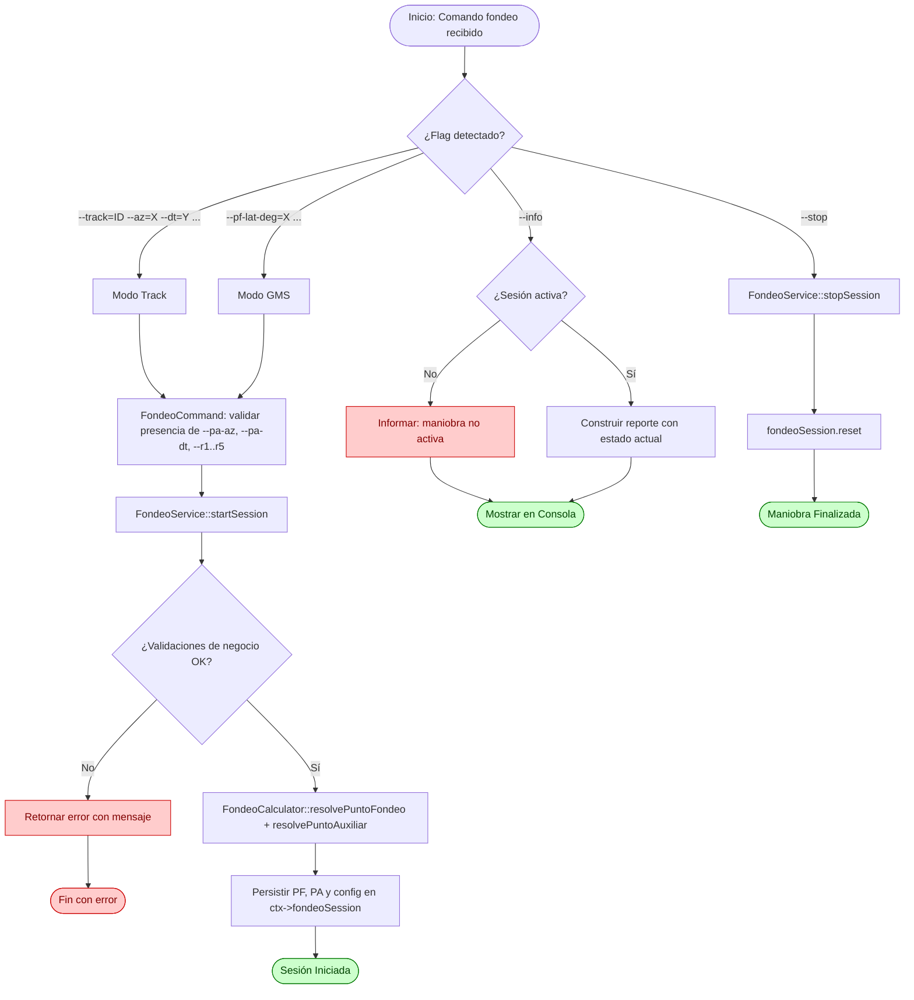
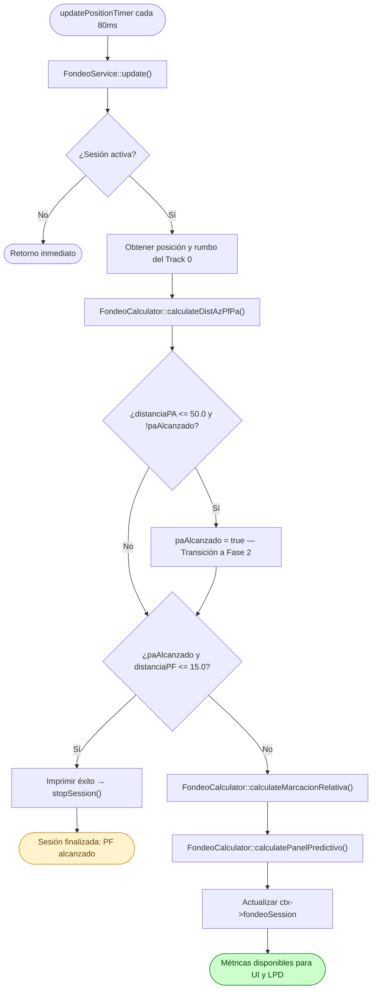

# Flujo: Fondeo

## Descripción general

Este flujo documenta la gestión y el cálculo cinemático continuo del módulo de **Maniobra de Fondeo**. Su propósito es asistir al operador en la aproximación de precisión del Buque Propio (`Track 0`) hacia un **Punto de Fondeo (PF)** designado, con guía continua a través de un **Punto Auxiliar (PA)** de aproximación intermedia.

El sistema calcula automáticamente en cada ciclo las distancias y azimuts verdaderos hacia el PF y el PA, la marcación relativa al objetivo activo según la fase de la maniobra, y un **panel predictivo de cinco anillos** que recomienda el movimiento de máquinas requerido (ej. AD. TODA, PARA MAQ) indicando la distancia exacta en yardas al umbral de accionamiento.

El PF puede ser designado mediante dos modos mutuamente excluyentes: **Track de referencia** (azimut y distancia desde un track existente) o **coordenadas GMS** (latitud y longitud en grados, minutos y segundos).

---

## Lista de archivos y clases

| Archivo | Clase/Struct | Responsabilidad |
|---|---|---|
| `src/controller/commands/fondeoCommand.cpp` | `FondeoCommand` | Entrada CLI para iniciar (`--track` o `--pf-lat-*`), detener (`--stop`) y consultar (`--info`) la maniobra. |
| `src/controller/services/fondeoService.cpp` | `FondeoService` | Orquestador del ciclo de vida de la sesión (start/stop) e integrador con el bucle de actualización. |
| `src/model/fondeo/fondeoCalculator.cpp` | `FondeoCalculator` | Motor matemático puro encargado de proyectar los puntos y resolver la cinemática de aproximación. |
| `src/model/fondeo/fondeoSessionState.h` | `FondeoSessionState`, `FondeoConfig` | Estructuras de datos que persisten la configuración y el estado dinámico de la maniobra. |
| `src/model/commandContext.h` | `CommandContext` | Contenedor global que aloja la sesión activa `fondeoSession` dentro del pipeline del sistema. |

---

## Clases principales

### FondeoCommand

- **Rol**: Wrapper CLI encargado exclusivamente del análisis sintáctico de tokens. Detecta el modo de operación (Track vs. GMS), valida la presencia de parámetros obligatorios y convierte las cadenas de texto a tipos primitivos. No contiene reglas de negocio: delega toda validación semántica y ejecución a `FondeoService`.

- **Métodos clave**:

| Método | Firma | Descripción |
|---|---|---|
| Ejecutar | `CommandResult execute(const CommandInvocation& inv, CommandContext& ctx) const` | Modula entre los modos operativos (`--info`, `--stop`, o inicialización de sesión por Track o GMS). |

- **Validación en CLI**: limitada a la presencia de parámetros obligatorios (`--pa-az`, `--pa-dt`, `--r1` a `--r5`), la detección del modo (`--track` vs. `--pf-lat-deg`), la exclusividad mutua entre modos, y la conversión de tipos primitivos (`toInt`, `toDouble`). Las reglas de negocio (radios decrecientes, track existente, azimut en rango, distancia positiva) se resuelven en `FondeoService`.

### FondeoService

- **Rol**: Interfaz de control operativo. Centraliza las reglas de validación de negocio (exclusividad de modos, validez del azimut del PA, distancia del PA positiva, radios estrictamente decrecientes y positivos, existencia del track de referencia o del Track 0), orquesta la resolución de los puntos estáticos mediante `FondeoCalculator`, y administra el ciclo de vida de la sesión. Coordina también la lógica de transición de fases (PA → PF) y la detención automática.

- **Struct de resultado**:

```cpp
struct FondeoOperationResult {
    bool success;
    QString message;
};
```

- **Métodos clave**:

| Método | Firma | Descripción |
|---|---|---|
| Iniciar Sesión | `FondeoOperationResult startSession(const FondeoConfig& config)` | Valida reglas de negocio, resuelve las coordenadas estáticas del PF y el PA, y activa la sesión en el contexto. |
| Finalizar Sesión | `FondeoOperationResult stopSession()` | Llama a `reset()` de la sesión y registra el evento en consola. |
| Actualización | `void update()` | Extrae la posición y el rumbo del Buque Propio, delega los cálculos al `FondeoCalculator` y gestiona las transiciones de fase y la detención automática. |


### FondeoCalculator

- **Rol**: Motor de cómputo puro que opera bajo un esquema de pipeline con funciones estáticas. En la inicialización, proyecta las coordenadas cartesianas del PF y el PA. Durante el ciclo dinámico, actualiza distancias, azimuts, marcación relativa y el panel predictivo, modificando el `FondeoSessionState` por referencia sin alterar su ciclo de vida.

- **Métodos clave**:

| Método | Firma | Descripción |
|---|---|---|
| Resolver PF (Track) | `static QPointF resolvePuntoFondeo(const FondeoConfig&, const QPointF& trackPos)` | Proyecta el PF utilizando un vector de desplazamiento polar desde un blanco existente. |
| Resolver PF (GMS) | `static QPointF resolvePuntoFondeo(const FondeoConfig&, double ownLatDeg, double ownLonDeg)` | Proyecta el PF convirtiendo coordenadas geodésicas absolutas a DM mediante `RadarMath::latLonToDm`. |
| Resolver PA | `static QPointF resolvePuntoAuxiliar(const QPointF& pf, double paAz, double paDt)` | Proyecta el PA desde el PF usando el azimut y la distancia configurados. |
| Calcular distancias y azimuts | `static void calculateDistAzPfPa(const QPointF& ownPos, FondeoSessionState& out_state)` | Calcula las distancias (DM → yardas) y los azimuts verdaderos desde el BP hacia el PF y el PA, actualizando el estado. |
| Calcular marcación relativa | `static void calculateMarcacionRelativa(double ownCourseDeg, FondeoSessionState& out_state)` | Determina el azimut relativo al objetivo activo (PA en Fase 1, PF en Fase 2) neutralizando el rumbo del BP. |
| Panel predictivo | `static void calculatePanelPredictivo(FondeoSessionState& out_state)` | Evalúa la distancia al PF contra los cinco anillos y actualiza las estructuras `movimientoActual` y `proximoMovimiento` (asignando etiqueta y distancia al anillo correspondiente). |

- **Consideraciones técnicas del motor**:
  - **Conversión de unidades**: Las distancias en millas náuticas (Mn) se convierten a Data Miles (DM) con el factor **1 Mn = 1.012685 DM**. Las distancias en DM se convierten a yardas con el factor constante **1 DM = 2000 yardas** (`RadarMath::dmToYards`).
  - **Proyección trigonométrica**: Los ángulos en grados se convierten a radianes antes del cálculo. El eje Y apunta al Norte y el eje X al Este: `x = x_origen + d * sin(θ)`, `y = y_origen + d * cos(θ)`.
  - **Sobrecarga de Métodos**: El motor implementa *Method Overloading* en `resolvePuntoFondeo` para procesar de forma transparente tanto la geometría polar (Track) como la proyección geodésica directa (GMS).

---

## Flujo de datos (Ciclo de Vida del Comando)



### Flujo CLI (Paso a Paso)

El usuario ejecuta el comando utilizando una de las siguientes sintaxis:

```bash
# Modo Track de referencia
fondeo --track=<id> --az=<grados> --dt=<mn> --pa-az=<grados> --pa-dt=<mn> --r1=<yds> --r2=<yds> --r3=<yds> --r4=<yds> --r5=<yds>

# Modo GMS
fondeo --pf-lat-deg=<g> --pf-lat-min=<m> --pf-lat-sec=<s> --pf-lon-deg=<g> --pf-lon-min=<m> --pf-lon-sec=<s> --pa-az=<grados> --pa-dt=<mn> --r1=<yds> --r2=<yds> --r3=<yds> --r4=<yds> --r5=<yds>

fondeo --stop
fondeo --info
```

1. `FondeoCommand::execute` intercepta los argumentos y los procesa en un `QMap<QString, QString>`, normalizando claves a minúsculas y removiendo guiones.
2. El comando detecta el modo (`--track` vs. `--pf-lat-deg`) y verifica exclusividad mutua. Si se activan ambos o ninguno, retorna error inmediato.
3. Se valida la presencia de `--pa-az`, `--pa-dt` y los cinco radios (`--r1` a `--r5`). Solo se verifica presencia y conversión de tipo; la semántica queda en el servicio.
4. Se construye un `FondeoConfig` y se invoca `FondeoService::startSession(config)`.
5. El servicio valida las reglas de negocio. Si alguna falla, devuelve el estado y el mensaje correspondiente mediante la estructura `FondeoOperationResult`.
6. Si todo es válido, el servicio delega al `FondeoCalculator` la proyección estática del PF y el PA, persiste los resultados en `ctx->fondeoSession` y activa la sesión.
7. A partir del inicio exitoso, el bucle de actualización continuo toma el control.

---

### Ciclo de Recálculo Continuo (Bucle Activo)

La maniobra se evalúa de forma continua mediante el temporizador asincrónico de `main.cpp`:



---

## Estructuras de Datos Clave

### Asesoramiento de Movimiento (`AsesoramientoMovimiento`)


Estructura anidada que representa un estado del panel predictivo.

- **Orden de máquinas**: `label` Cadena de texto con la orden de máquinas (ej. "AD. TODA", "MAQ AT").
- **Distancia al anillo**: `distancia` Valor decimal (double) con la distancia remanente en yardas hacia el anillo correspondiente.

### Configuración de Sesión (`FondeoConfig`)

Estructura inmutable durante la sesión. Almacena todos los parámetros ingresados por el operador al momento de invocar el comando:

- **Selectores de modo**: `useTrack`, `useGms` (mutuamente excluyentes).
- **Modo Track**: `trackId`, `trackAz` (grados), `trackDt` (Mn).
- **Modo GMS**: `pfLatDeg`, `pfLatMin`, `pfLatSec`, `pfLonDeg`, `pfLonMin`, `pfLonSec`.
- **Punto Auxiliar**: `paAz` (grados), `paDt` (Mn).
- **Radios de marcha**: `r1` a `r5` (yardas), con la invariante `r1 > r2 > r3 > r4 > r5 > 0`.

### Estado de Sesión (`FondeoSessionState`)

Mantiene la separación limpia entre datos estáticos fijados al inicio y métricas dinámicas actualizadas en cada ciclo:

- **Control de sesión**: `active`, `paAlcanzado` (bandera de transición de fase).
- **Puntos estáticos**: `puntoFondeo` (QPointF en DM), `puntoAuxiliar` (QPointF en DM).
- **Configuración**: `config` (instancia de `FondeoConfig`).
- **Telemetría dinámica**: `distanciaPF`, `azimutPF`, `distanciaPA`, `azimutPA` (distancias en yardas, azimuts en grados).
- **Asesoramiento activo**: `azimutRelativo`, `distanciaRelativa` (referenciados al objetivo de la fase actual: PA o PF).
- **Panel predictivo**: `movimientoActual`, `proximoMovimiento` (estructura AsesoramientoMovimiento que contiene la etiqueta técnica del comando y la distancia en yardas restante hacia el anillo correspondiente).

---

## Manejo de Errores y Casos de Borde

- **Validación de Señal Geográfica (GPS)**: Al iniciar la maniobra usando coordenadas GMS, el servicio verifica primero que el Buque Propio (`m_ctx->ownShip`) tenga datos reales de posicionamiento. Si la unidad no tiene señal o su posición no es válida, se aborta el comando para evitar proyectar coordenadas desde el origen `(0,0)`.
- **Exclusividad mutua de modos**: `FondeoCommand` rechaza de inmediato si se detectan simultáneamente `--track` y `--pf-lat-deg`, o si no se detecta ninguno de los dos.
- **Radios no decrecientes**: `FondeoService` rechaza la sesión si no se cumple estrictamente `r1 > r2 > r3 > r4 > r5 > 0`, protegiendo la lógica de la máquina de estados del panel predictivo.
- **Azimut del PA fuera de rango**: `FondeoService` valida que `paAz ∈ [0, 360)` antes de iniciar.
- **Track de referencia inexistente**: Si el modo Track está activo y `findTrackById(config.trackId)` devuelve `nullptr`, la sesión no se inicia y se retorna un error descriptivo.
- **Proyección estática e inmunidad a pérdida de track**: Las coordenadas del PF y el PA se calculan una sola vez durante la inicialización. Si el track de referencia desaparece durante la maniobra, los puntos persisten sin riesgo de punteros nulos, y la maniobra continúa normalmente.
- **Normalización angular**: Todos los azimuts de salida se normalizan al rango `[0, 360)` mediante `RadarMath::normalizeAngle360` y la operación módulo, previniendo valores negativos o ≥360° en la interfaz.
- **Detención automática por éxito**: Cuando `paAlcanzado == true` y `distanciaPF <= 15.0`, el servicio imprime un mensaje de éxito y llama a `stopSession()` automáticamente, sin intervención del operador.

---

## Módulos Relacionados

- `src/model/commandContext.h` — Estructura general de ejecución.
- `docs/modules/ha.md` — Pipeline homólogo de emergencia con conversión GMS y cálculo cinemático continuo.
- `docs/modules/2w.md` — Pipeline homólogo de formación táctica continua.
