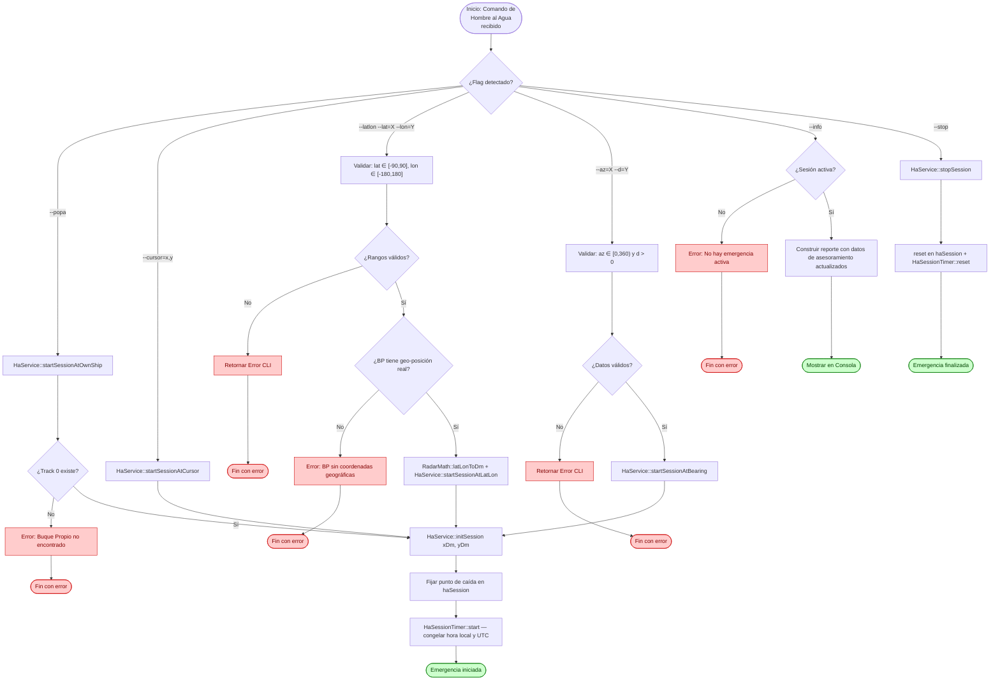
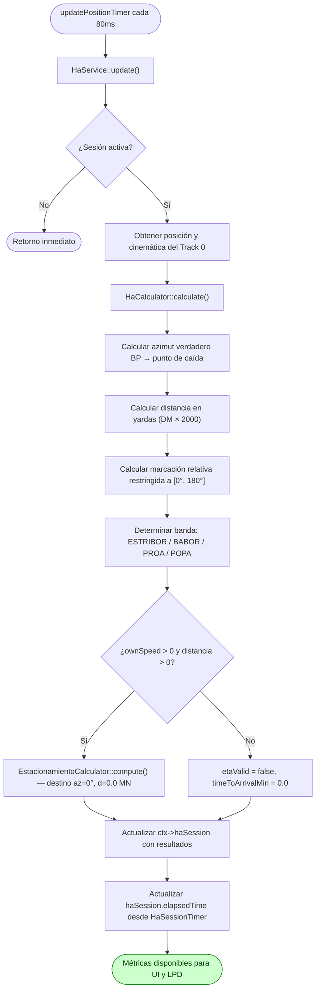

# Flujo: Hombre al Agua (HA)

## Descripción general

Este flujo documenta la gestión y el cálculo cinemático continuo del módulo de **Rescate de Hombre al Agua (HA)**. Ante el evento de caída de personal por la borda, el sistema fija de forma inmutable la coordenada geográfica del punto de caída y genera un asesoramiento continuo de orientación (azimut verdadero y marcación relativa), distancia en yardas, tiempo estimado de arribo y datos temporales (hora de caída y cronómetro).

El sistema admite cuatro disparadores de inicio mutuamente excluyentes: posición del Buque Propio, posición del cursor (OBM), coordenada geográfica manual (Lat/Lon) y azimut verdadero + distancia en yardas desde el Buque Propio.

---

## Lista de archivos y clases

| Archivo | Clase/Struct | Responsabilidad |
|---|---|---|
| `src/controller/commands/haCommand.cpp` | `HaCommand` | Entrada CLI para iniciar (`--popa`, `--cursor`, `--latlon`, `--az`), detener (`--stop`) y consultar (`--info`) la emergencia. |
| `src/controller/services/haService.cpp` | `HaService` | Orquestador del ciclo de vida de la sesión (start/stop) e integrador con el bucle de actualización. |
| `src/model/ha/haCalculator.cpp` | `HaCalculator` | Motor matemático puro encargado de calcular azimuts, marcación relativa, banda y tiempo de arribo. |
| `src/model/ha/haSessionState.h` | `HaSessionState` | Estructura de datos que persiste el estado dinámico y los resultados calculados de la emergencia. |
| `src/model/ha/haSessionTimer.cpp` | `HaSessionTimer` | Captura y congela el timestamp de inicio; calcula el tiempo transcurrido en formato HH:MM:SS. |
| `src/model/commandContext.h` | `CommandContext` | Contenedor global que aloja la sesión activa `haSession` dentro del pipeline del sistema. |

---

## Clases principales

### HaCommand

- **Rol**: Wrapper CLI encargado del análisis sintáctico de tokens y de la validación de las reglas de negocio de entrada. No contiene reglas de negocio: delega toda validación y ejecución a `HaService`, devolviendo directamente el `HaOperationResult` recibido.

- **Métodos clave**:

| Método | Firma | Descripción |
|---|---|---|
| Ejecutar | `CommandResult execute(const CommandInvocation& inv, CommandContext& ctx) const` | Parsea tokens, determina el modo invocado (`--info`, `--stop`, o los cuatro disparadores) e invoca el método correspondiente de `HaService`. |

- **Reglas de Validación CLI**:
  - `--az` (disparador 4) requiere el parámetro adicional `--d` (distancia en yardas, estrictamente `> 0.0`).
  - `--az` debe ser un valor flotante en el rango `[0.0, 360.0)`.
  - `--latlon` requiere los parámetros adicionales `--lat` y `--lon` en rangos geográficos válidos.
  - Los cuatro disparadores son mutuamente excluyentes; no se admite más de uno simultáneamente.

### HaService

- **Rol**: Interfaz de control operativo. Centraliza las reglas de validación de negocio (rangos numéricos, existencia de Track 0, disponibilidad de datos geográficos), resuelve la coordenada del punto de caída según el disparador activo, y administra el ciclo de vida de la sesión. Todos los métodos públicos de operación devuelven un `HaOperationResult` uniforme.

- **Struct de resultado**:

```cpp
struct HaOperationResult {
    bool    ok = false;
    QString message;
};
```
- **Métodos clave**:

| Método | Firma | Descripción |
|---|---|---|
| Disparador 1 | `HaOperationResult startSessionAtOwnShip()` | Fija el punto en la posición actual del Buque Propio (Track 0). Falla si el Track 0 no existe. |
| Disparador 2 | `HaOperationResult startSessionAtCursor(double cursorXDm, double cursorYDm)` | Fija el punto en las coordenadas del cursor OBM. |
| Disparador 3 | `HaOperationResult startSessionAtLatLonDms(int latDeg, int latMin, double latSec, int lonDeg, int lonMin, double lonSec)` | Convierte GMS a grados decimales vía `RadarMath::dmsToDecimal` y delega en el método privado `startSessionAtLatLon(double, double)`, que valida rangos, valida geo-posición real del BP, convierte a DM vía `RadarMath::latLonToDm` y fija el punto. |
| Disparador 4 | `HaOperationResult startSessionAtBearing(double azimuthDeg, double distanceYards)` | Valida rangos, proyecta el punto desde el Buque Propio por azimut verdadero y distancia en yardas. |
| Finalizar | `HaOperationResult stopSession()` | Llama al método `reset()` de la estructura de datos y del cronómetro. Falla si no hay sesión activa. |
| Reporte | `HaOperationResult infoReport() const` | Construye el reporte de asesoramiento de la sesión activa. Falla si no hay sesión activa. |
| Actualización | `void update()` | Extrae la posición cinemática actual del Buque Propio e invoca el recálculo. |

- **Métodos internos**:
  - `void initSession(double xDm, double yDm)`: método privado común a todos los disparadores. Una vez resuelta la coordenada, fija el punto, inicia el `HaSessionTimer` y congela las horas de caída (local y UTC).

  - `HaOperationResult startSessionAtLatLon(double lat, double lon)` : método privado. Conserva toda la lógica de validación de rangos y conversión geográfica; es reutilizado exclusivamente por `startSessionAtLatLonDms`.

### HaCalculator

- **Rol**: Motor de cómputo puro que, dada la posición actual del Buque Propio y el punto de caída fijo, calcula todos los datos de asesoramiento.
- **Métodos clave**:

| Método | Firma | Descripción |
|---|---|---|
| Calcular | `static void calculate(QPointF ownPos, double ownCourseDeg, double ownSpeedDm, QPointF fallPoint, HaSessionState& outState)` | Calcula azimut verdadero, marcación relativa, banda, distancia en yardas y ETA hacia el punto de caída. |

- **Consideraciones técnicas del motor**:
  - **Conversión de unidades**: Utiliza el factor constante $1\text{ DM} = 2000\text{ yardas}$ para expresar la distancia al operador.
  - **Restricción de marcación relativa**: La marcación relativa se fuerza siempre al rango $[0°, 180°]$, devolviendo el valor angular menor hacia el punto.
  - **Tiempo de arribo**: Reutiliza `EstacionamientoCalculator` inyectando como destino el azimut `000°` y distancia `0.0 MN` desde el punto de caída (intercepción directa, distancia cero).
  - **Determinación de banda**: Se calcula según el ángulo relativo del punto respecto a la proa: `ESTRIBOR` `[0°, 180°)`, `BABOR` `(180°, 360°)`, `PROA` en `≈0°` y `POPA` en `≈180°`.

### RadarMath::latLonToDm (conversión geográfica)

- **Rol**: Función utilitaria que resuelve el disparador 3, proyectando una coordenada geográfica (Lat/Lon) al plano cartesiano DM del radar.
- **Firma**: `static void latLonToDm(double originLat, double originLon, double targetLat, double targetLon, double& outXDm, double& outYDm)`
- **Método**: proyección equirectangular simple (válida para distancias cortas), usando como origen la latitud/longitud actual del Buque Propio (`ctx->ownShip.latitudeDeg/longitudeDeg`) y como factor de escala 111.320 m/grado y 1.828,8 m/DM.
- **Dependencia crítica de modo de operación**: esta solución es matemáticamente válida únicamente porque, en `CommandContext::updateTracks`, cuando `motionMode == RELATIVE`, el Track 0 se fuerza explícitamente a la coordenada `(0.0, 0.0)` en cada ciclo (`OwnShip stays anchored at center`). Esto hace que la posición geográfica real del BP coincida siempre con el origen `(0,0)` del plano DM, permitiendo usarla como referencia de conversión sin necesidad de una variable de origen fija del radar. **Si el sistema opera en modo `TRUE_MOTION`, esta suposición deja de ser válida** y la conversión quedaría desalineada.
- **Precondición de uso**: `HaService::startSessionAtLatLon` solo invoca la conversión si `ctx->ownShip.valid` es `true` y la geo-posición del BP no es `(0.0, 0.0)` (lo cual indicaría datos no inicializados). Si esta condición no se cumple, el disparador falla con un `HaOperationResult` negativo sin iniciar la sesión.
- **Conversión de formato GMS**: el disparador 3 recibe la coordenada en formato Grados-Minutos-Segundos. `RadarMath::dmsToDecimal(int degrees, int minutes, double seconds)` convierte cada componente (latitud y longitud por separado) a grados decimales antes de invocar `latLonToDm`. El signo del resultado se toma del signo de `degrees`.

### HaSessionTimer

- **Rol**: Responsable exclusivo del manejo temporal de la emergencia.
- **Métodos clave**:

| Método | Firma | Descripción |
|---|---|---|
| Iniciar | `void start()` | Captura y congela el timestamp del sistema operativo al momento del disparo. |
| Hora local | `QString fallTimeLocal() const` | Devuelve la hora de caída en formato `HH:mm:ss` (hora local). |
| Hora UTC | `QString fallTimeUtc() const` | Devuelve la hora de caída en formato `HH:mm:ss` (UTC). |
| Tiempo transcurrido | `QString elapsedTime() const` | Calcula la diferencia entre el timestamp fijo y el instante actual en formato `HH:MM:SS`. |
| Resetear | `void reset()` | Borra el timestamp y vuelve al estado inactivo. |

---

## Flujo de datos (Ciclo de Vida del Comando)



### Flujo CLI (Paso a Paso)

El usuario ejecuta el comando en la consola utilizando cualquiera de las siguientes sintaxis:

```bash
ha --popa
ha --cursor=<xDm>,<yDm>
ha --latlon --lat=<deg>,<min>,<sec> --lon=<deg>,<min>,<sec>
ha --az=<azimut> --d=<distancia_yardas>
ha --stop
ha --info
```

1. `HaCommand::execute` intercepta los argumentos y determina cuál de los seis modos fue invocado.
2. El comando realiza únicamente validaciones de forma (presencia de parámetros obligatorios, conversión de tipos). Las validaciones de rango y de reglas de negocio se delegan a `HaService`.
3. Se invoca el método correspondiente de `HaService`, que valida internamente (rangos, existencia de Track 0, disponibilidad geográfica), resuelve la coordenada cartesiana del punto de caída (en DM) y, si todo es correcto, llama a `initSession(xDm, yDm)`.
4. `initSession` fija el punto en `CommandContext::haSession`, inicia `HaSessionTimer` y congela `fallTimeLocal` y `fallTimeUtc`.
5. El resultado de cualquier operación —exitosa o fallida— se devuelve como `HaOperationResult { bool ok, QString message }`, que `HaCommand` traduce directamente a `CommandResult`.
6. A partir del inicio exitoso de la sesión, el bucle de actualización continuo toma el control.

---

### Ciclo de Recálculo Continuo (Bucle Activo)

El módulo HA se evalúa de manera continua mediante el temporizador asincrónico de `main.cpp`:



---

## Estructuras de Datos Clave

### Estado de Sesión (`HaSessionState`)

Mantiene la separación limpia entre datos fijos al inicio de la emergencia y métricas dinámicas actualizadas en cada ciclo:

- **Datos de control**: `active`, `fallPointX`, `fallPointY`.
- **Datos temporales fijos**: `fallTimeLocal`, `fallTimeUtc` (congelados al disparar).
- **Dato temporal dinámico**: `elapsedTime` (se recalcula en cada ciclo).
- **Asesoramiento cinemático**: `trueAzimuthDeg`, `relativeBearingDeg`, `banda`, `distanceYards`, `timeToArrivalMin`, `etaValid`.
---

## Manejo de Errores y Casos de Borde

- **Track 0 inexistente**: Si el disparador 1 (`--popa`) o el disparador 4 (`--az`) no encuentran el Track 0 del Buque Propio, el servicio interrumpe `initSession` y retorna un error operativo.
- **Velocidad cero**: Si `ownSpeed == 0.0`, el sistema deshabilita de forma segura `etaValid = false` para evitar divisiones por cero en el cálculo de ETA.
- **Punto de caída sobre el Buque Propio**: Si la distancia al punto es `0.0 DM`, el ETA se inhabilita (`etaValid = false`) y la distancia reportada es `0 yardas`.
- **Disparador Lat/Lon — BP sin geo-posición**: `startSessionAtLatLon` valida que `ctx->ownShip.valid` sea verdadero y que la geo-posición del BP no sea `(0.0, 0.0)` (dato no inicializado) antes de convertir. Si esta condición no se cumple, el disparador falla con un mensaje operativo y no inicia la sesión.
- **Disparador Lat/Lon — dependencia del modo de operación**: La conversión `RadarMath::latLonToDm` usa la geo-posición actual del Buque Propio como origen del plano DM. Esto es válido únicamente porque, en modo `RELATIVE`, `CommandContext::updateTracks` ancla el Track 0 a `(0,0)` en cada ciclo. 
- **Sesión preexistente**: Al invocar cualquier disparador de inicio mientras hay una sesión activa, el sistema sobreescribe el estado anterior mediante `reset()` antes de fijar el nuevo punto, garantizando que no queden residuos de la emergencia anterior.

---

## Módulos Relacionados

- `src/model/commandContext.h` — Estructura general de ejecución.
- `docs/modules/estacionamiento.md` — Pipeline del motor de cálculo reutilizado para el ETA.
- `docs/modules/2w.md` — Pipeline homólogo de formación táctica continua.
