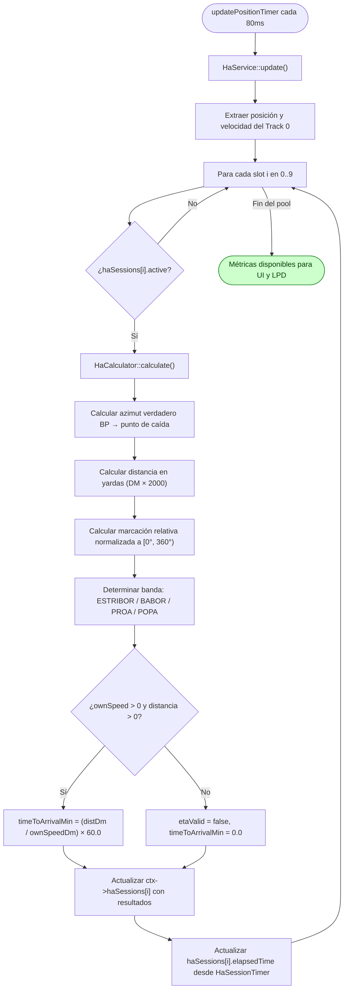

# Flujo: Hombre al Agua (HA)

## Descripción general

Este flujo documenta la gestión y el cálculo cinemático continuo del módulo de **Rescate de Hombre al Agua (HA)**. Ante el evento de caída de personal por la borda, el sistema fija de forma inmutable la coordenada geográfica del punto de caída y genera un asesoramiento continuo de orientación (azimut verdadero y marcación relativa), distancia en yardas, tiempo estimado de arribo y datos temporales (hora de caída y cronómetro).

El sistema admite cuatro disparadores de inicio mutuamente excluyentes: posición del Buque Propio, posición del cursor (OBM), coordenada geográfica manual (Lat/Lon) y azimut verdadero + distancia en yardas desde el Buque Propio. El módulo soporta hasta 10 emergencias simultáneas, cada una identificada por un número de slot. El operador puede consultar, detener y seleccionar cualquier slot independientemente.

---

## Lista de archivos y clases

| Archivo | Clase/Struct | Responsabilidad |
|---|---|---|
| `src/controller/commands/haCommand.cpp` | `HaCommand` | Entrada CLI para iniciar (`--popa`, `--cursor`, `--latlon`, `--az`), detener (`--stop`) y consultar (`--info`) la emergencia. |
| `src/controller/services/haService.cpp` | `HaService` | Orquestador del ciclo de vida de la sesión (start/stop) e integrador con el bucle de actualización. Recibe `ObmService*` por constructor para leer la posición en vivo de la OBM (disparador 2). |
| `src/model/ha/haCalculator.cpp` | `HaCalculator` | Motor matemático puro encargado de calcular azimuts, marcación relativa, banda y tiempo de arribo. |
| `src/model/ha/haSessionState.h` | `HaSessionState` | Estructura de datos que persiste el estado dinámico y los resultados calculados de la emergencia. Cada slot del pool de 10 instancias es un HaSessionState independiente.|
| `src/model/ha/haSessionTimer.cpp` | `HaSessionTimer` | Captura y congela el timestamp de inicio; calcula el tiempo transcurrido en formato HH:MM:SS. Vive como campo `timer` dentro de cada `HaSessionState` (no como estado privado de `HaService`), para que cualquier instancia de `HaService` (CLI, bucle de 80ms, JSON) comparta el mismo timer real. |
| `src/model/commandContext.h` | `CommandContext` | Contenedor global que aloja el pool de 10 sesiones haSessions[] y el slot activo activeHaSlot dentro del pipeline del sistema. |
| `src/controller/json/jsoncommandhandler.cpp` | `JsonCommandHandler` | Expone HA al frontend AR-TDC vía comandos JSON (`ha_start/stop/info/list/select`), instanciando su propio `HaService` sobre el mismo `CommandContext`. |

---

## Clases principales

### HaCommand

- **Rol**: Wrapper CLI encargado del análisis sintáctico de tokens y de la validación de las reglas de negocio de entrada. No contiene reglas de negocio: delega toda validación y ejecución a `HaService`, devolviendo directamente el `HaOperationResult` recibido.

- **Métodos clave**:

| Método | Firma | Descripción |
|---|---|---|
| Ejecutar | `CommandResult execute(const CommandInvocation& inv, CommandContext& ctx) const` | Parsea tokens, determina el modo invocado (`--info`, `--stop`, o los cuatro disparadores) e invoca el método correspondiente de `HaService`. |

- **Reglas de Validación CLI**:
  - `--az` (disparador 4) requiere el parámetro adicional `--d` (distancia en yardas, estrictamente `> 0.0`).
  - `--az` debe ser un valor flotante en el rango `[0.0, 360.0)`.
  - `--latlon` requiere los parámetros adicionales `--lat` y `--lon` en rangos geográficos válidos.
  - Los cuatro disparadores son mutuamente excluyentes; no se admite más de uno simultáneamente.

### HaService

- **Rol**: Interfaz de control operativo. Centraliza las reglas de validación de negocio (rangos numéricos, existencia de Track 0, disponibilidad de datos geográficos), resuelve la coordenada del punto de caída según el disparador activo, y administra el ciclo de vida de la sesión. Todos los métodos públicos de operación devuelven un `HaOperationResult` uniforme.

- **Struct de resultado**:

```cpp
struct HaOperationResult {
    bool    ok = false;
    QString message;
};
```
- **Métodos clave**:

| Método | Firma | Descripción |
|---|---|---|
| Disparador 1 | `HaOperationResult startSessionAtOwnShip()` | Fija el punto en la posición actual del Track 0. Falla si no existe. |
| Disparador 2 | `HaOperationResult startSessionAtCursor()` | Fija el punto en la posición actual de la OBM, leída en vivo vía `ObmService::getCurrentPosition()` (inyectado en el constructor de `HaService`) — no recibe coordenadas por parámetro, igual que `CursorCommandHandler`/`GeometryCommandHandler` para "crear en la posición del cursor". |
| Disparador 3 | `HaOperationResult startSessionAtLatLonDms(int latDeg, int latMin, double latSec, int lonDeg, int lonMin, double lonSec)` | Convierte GMS a decimal vía `RadarMath::dmsToDecimal` y delega en `startSessionAtLatLon`. |
| Disparador 4 | `HaOperationResult startSessionAtBearing(double azimuthDeg, double distanceYards)` | Valida rangos y proyecta el punto desde el Track 0 por azimut y distancia en yardas. |
| Finalizar | `HaOperationResult stopSession(int slotIndex = -1)` | Sin argumento: finaliza todos los slots activos. Con argumento: finaliza el slot específico. |
| Reporte | `HaOperationResult infoReport(int slotIndex) const` | Construye el reporte del slot indicado. Falla si no está activo. |
| Seleccionar slot | `HaOperationResult selectSlot(int slotIndex)` | Marca el slot indicado como `activeHaSlot` en el contexto. |
| Actualización | `void update()` | Recalcula **todos** los slots activos del pool. |
| Helper interno | `int nextFreeSlot() const` | Devuelve el primer índice libre del array (1-based), o `-1` si todos están ocupados. |
| Helper interno | `void initSession(double xDm, double yDm)` | Toma el primer slot libre, inicializa su `HaSessionState` y su `HaSessionTimer`, y fija `activeHaSlot`. |

### HaCalculator

- **Rol**: Motor de cómputo puro que, dada la posición actual del Buque Propio y el punto de caída fijo, calcula todos los datos de asesoramiento.
- **Métodos clave**:

| Método | Firma | Descripción |
|---|---|---|
| Calcular | `static void calculate(QPointF ownPos, double ownCourseDeg, double ownSpeedDm, QPointF fallPoint, HaSessionState& outState)` | Calcula azimut verdadero, marcación relativa, banda, distancia en yardas y ETA hacia el punto de caída. |

- **Consideraciones técnicas del motor**:
  - **Conversión de unidades**: Utiliza el factor constante $1\text{ DM} = 2000\text{ yardas}$ para expresar la distancia al operador.
  - **Marcación relativa**: Se obtiene como (trueAzimuthDeg − ownCourseDeg) normalizado a [0°, 360°) vía RadarMath::normalizeAngle360. No se restringe al ángulo menor.
  - **Tiempo de arribo**: Cálculo directo en `HaCalculator` — `timeToArrivalMin = (distDm / ownSpeedDm) * 60.0`. Se calcula únicamente cuando `ownSpeedDm > 0.0` y `distDm > 0.0`; en caso contrario `etaValid` se fija como `false`.
  - **Determinación de banda**: Se calcula según el ángulo relativo del punto respecto a la proa: `ESTRIBOR` `[0°, 180°)`, `BABOR` `(180°, 360°)`, `PROA` en `≈0°` y `POPA` en `≈180°`.

### RadarMath::latLonToDm (conversión geográfica)

- **Rol**: Función utilitaria que resuelve el disparador 3, proyectando una coordenada geográfica (Lat/Lon) al plano cartesiano DM del radar.
- **Firma**: `static void latLonToDm(double originLat, double originLon, double targetLat, double targetLon, double& outXDm, double& outYDm)`
- **Método**: proyección equirectangular simple (válida para distancias cortas), usando como origen la latitud/longitud actual del Buque Propio (`ctx->ownShip.latitudeDeg/longitudeDeg`) y como factor de escala 111.320 m/grado y 1.828,8 m/DM.
- **Dependencia crítica de modo de operación**: esta solución es matemáticamente válida únicamente porque, en `CommandContext::updateTracks`, cuando `motionMode == RELATIVE`, el Track 0 se fuerza explícitamente a la coordenada `(0.0, 0.0)` en cada ciclo (`OwnShip stays anchored at center`). Esto hace que la posición geográfica real del BP coincida siempre con el origen `(0,0)` del plano DM, permitiendo usarla como referencia de conversión sin necesidad de una variable de origen fija del radar. **Si el sistema opera en modo `TRUE_MOTION`, esta suposición deja de ser válida** y la conversión quedaría desalineada.
- **Precondición de uso**: `HaService::startSessionAtLatLon` solo invoca la conversión si `ctx->ownShip.valid` es `true` y la geo-posición del BP no es `(0.0, 0.0)` (lo cual indicaría datos no inicializados). Si esta condición no se cumple, el disparador falla con un `HaOperationResult` negativo sin iniciar la sesión.
- **Conversión de formato GMS**: el disparador 3 recibe la coordenada en formato Grados-Minutos-Segundos. `RadarMath::dmsToDecimal(int degrees, int minutes, double seconds)` convierte cada componente (latitud y longitud por separado) a grados decimales antes de invocar `latLonToDm`. El signo del resultado se toma del signo de `degrees`.

### HaSessionTimer

- **Rol**: Responsable exclusivo del manejo temporal de la emergencia.
- **Métodos clave**:

| Método | Firma | Descripción |
|---|---|---|
| Iniciar | `void start()` | Captura y congela el timestamp del sistema operativo al momento del disparo. |
| Hora local | `QString fallTimeLocal() const` | Devuelve la hora de caída en formato `HH:mm:ss` (hora local). |
| Hora UTC | `QString fallTimeUtc() const` | Devuelve la hora de caída en formato `HH:mm:ss` (UTC). |
| Tiempo transcurrido | `QString elapsedTime() const` | Calcula la diferencia entre el timestamp fijo y el instante actual en formato `HH:MM:SS`. |
| Resetear | `void reset()` | Borra el timestamp y vuelve al estado inactivo. |

---

## Flujo de datos (Ciclo de Vida del Comando)

```mermaid
flowchart TD
    A([Inicio: Comando de 
    Hombre al Agua 
    recibido]) --> B{"¿Flag detectado?"}

    B -->|"--popa"| D1[HaService::startSessionAtOwnShip]
    B -->|"--cursor"| D2[HaService::startSessionAtCursor]
    B -->|"--latlon --lat=X --lon=Y"| V0["Validar: lat ∈ [-90,90], lon ∈ [-180,180]"]
    B -->|"--az=X --d=Y"| V1["Validar: az ∈ [0,360) y d > 0"]

    V0 --> VR0{"¿Rangos válidos?"}
    VR0 -->|No| E0[Retornar Error CLI] --> FE0([Fin con error])
    VR0 -->|Sí| GEO{"¿BP tiene geo-posición real?"}
    GEO -->|No| E4[Error: BP sin coordenadas geográficas] --> FE4([Fin con error])
    GEO -->|Sí| D3[RadarMath::latLonToDm + HaService::startSessionAtLatLon]

    V1 --> VR{"¿Datos válidos?"}
    VR -->|No| E1[Retornar Error CLI] --> FE1([Fin con error])
    VR -->|Sí| D4[HaService::startSessionAtBearing]

    D1 --> BP{"¿Track 0 existe?"}
    BP -->|No| E2[Error: Buque Propio no encontrado] --> FE2([Fin con error])
    BP -->|Sí| INIT

    D2 --> INIT[HaService::initSession xDm, yDm]
    D3 --> INIT
    D4 --> INIT

    INIT --> FIX[Fijar punto de caída en haSessions[idx]]
    FIX --> TIMER[HaSessionTimer::start — congelar hora local y UTC]
    TIMER --> Z1([Emergencia iniciada])

    B -->|"--info"| H{"¿Slot solicitado activo?"}
    H -->|No| I[Error: No hay emergencia activa] --> FE3([Fin con error])
    H -->|Sí| J[Construir reporte con datos de asesoramiento actualizados] --> ZF([Mostrar en Consola])

    B -->|"--stop"| K[HaService::stopSession]
    K --> L[reset en haSessions[slot] + HaSessionTimer::reset] --> Z2([Emergencia finalizada])

    classDef error fill:#ffcccc,stroke:#cc0000,color:#800000
    classDef ok fill:#ccffcc,stroke:#007700,color:#004400
    class E0,E1,E2,E4,I,FE0,FE1,FE2,FE3,FE4 error
    class Z1,Z2,ZF ok
```

### Flujo CLI (Paso a Paso)

El usuario ejecuta el comando en la consola utilizando cualquiera de las siguientes sintaxis:

```bash
ha --popa
ha --cursor
ha --latlon --lat=<deg>,<min>,<sec> --lon=<deg>,<min>,<sec>
ha --az=<azimut> --d=<distancia_yardas>
ha --stop [<slot>]
ha --info <slot>
ha --list
```

1. `HaCommand::execute` intercepta los argumentos y determina cuál de los seis modos fue invocado.
2. El comando realiza únicamente validaciones de forma (presencia de parámetros obligatorios, conversión de tipos). Las validaciones de rango y de reglas de negocio se delegan a `HaService`.
3. Se invoca el método correspondiente de `HaService`, que valida internamente (rangos, existencia de Track 0, disponibilidad geográfica), resuelve la coordenada cartesiana del punto de caída (en DM) y, si todo es correcto, llama a `initSession(xDm, yDm)`.
4. `initSession` toma el primer slot libre del pool, fija el punto en `ctx->haSessions[idx]`, inicia el `HaSessionTimer` correspondiente, congela `fallTimeLocal` y `fallTimeUtc`, y actualiza `ctx->activeHaSlot`.
5. El resultado de cualquier operación —exitosa o fallida— se devuelve como `HaOperationResult { bool ok, QString message }`, que `HaCommand` traduce directamente a `CommandResult`.
6. A partir del inicio exitoso de la sesión, el bucle de actualización continuo toma el control.

---

### Flujo JSON (Paso a Paso)

Es la vía que usará el frontend AR-TDC, en el mismo formato que ya usan Fondeo/CPA/Estacionamiento (ver `docs/flows/fondeo.md`). `JsonCommandHandler` mantiene su propia instancia de `HaService` (`m_haService`), separada de la que usa el bucle CLI/timer, pero ambas operan sobre el mismo pool `ctx->haSessions[]` — incluido el `HaSessionTimer` embebido en cada `HaSessionState`, por lo que no importa qué instancia arrancó una emergencia: el cronómetro es el mismo en cualquier consulta posterior.

| Comando JSON | Args | Descripción |
|---|---|---|
| `ha_start` | `mode` (`popa`\|`cursor`\|`latlon`\|`bearing`) + campos según el modo: `cursor` no requiere campos adicionales (lee la OBM en vivo); `lat_deg`/`lat_min`/`lat_sec`/`lon_deg`/`lon_min`/`lon_sec`; `az_deg`/`distance_yd` | Valida el modo y llama al `startSessionAtXxx` correspondiente de `HaService`. Devuelve el `slot` autoasignado (`ctx->activeHaSlot`). |
| `ha_stop` | `slot` (opcional, `-1`/ausente = todos) | Llama `HaService::stopSession(slot)`. |
| `ha_info` | `slot` (obligatorio, 1..10) | Lectura pura de `ctx->haSessions[slot-1]` (sin mutar estado): `active`, `fall_point_x_dm`, `fall_point_y_dm`, `true_azimuth_deg`, `relative_bearing_deg`, `banda`, `distance_yards`, `eta_valid`, `time_to_arrival_min`, `fall_time_local`, `fall_time_utc`, `elapsed_time`. Pensado para polling periódico desde la UI (no hay push espontáneo de JSON en el sistema). |
| `ha_list` | — | Devuelve un array con un resumen (`slot`, `fall_point_x_dm`, `fall_point_y_dm`, `fall_time_local`) de todos los slots activos, más `active_slot`. |
| `ha_select` | `slot` | Llama `HaService::selectSlot(slot)` para fijar `ctx->activeHaSlot`. |

1. `JsonCommandHandler::handleHaStart` lee el campo `mode` y arma los argumentos correspondientes a mano (mismo estilo que `handleFondeoStart`, sin un `JsonValidator` genérico), delegando la validación de rango/negocio a `HaService`.
2. Traduce el `HaOperationResult` recibido a `JsonResponseBuilder::buildSuccessResponse`/`buildErrorResponse`/`buildValidationErrorResponse`.
3. `handleHaInfo` y `handleHaList` no validan ni mutan nada: solo serializan el `HaSessionState` (o el pool completo) actual a JSON, campo por campo (no existe un `toJson()` genérico en el codebase; es el mismo patrón manual usado por `handleFondeoInfo`).

---

### Ciclo de Recálculo Continuo (Bucle Activo)

El módulo HA se evalúa de manera continua mediante el temporizador asincrónico de `main.cpp`:


> **Nota sobre la velocidad**: `HaService::update()` obtiene la velocidad del Buque Propio desde `ctx->ownShip.speedKnots` (convertida a DM/h dividiendo por `Track::kDmToNm`), no directamente desde el Track 0. Esto garantiza que el cálculo use la velocidad reportada por el sistema de navegación incluso si el Track 0 no tiene la velocidad sincronizada.
---

## Estructuras de Datos Clave

### Estado de Sesión (`HaSessionState`)

Mantiene la separación limpia entre datos fijos al inicio de la emergencia y métricas dinámicas actualizadas en cada ciclo:

- **Datos de control**: `active`, `slotIndex (1..10)`, `fallPointX`, `fallPointY`, `haIconCenter` (coordenada para renderizado en el radar).
- **Datos temporales fijos**: `fallTimeLocal`, `fallTimeUtc` (congelados al disparar).
- **Dato temporal dinámico**: `elapsedTime` (se recalcula en cada ciclo).
- **Asesoramiento cinemático**: `trueAzimuthDeg`, `relativeBearingDeg`, `banda`, `distanceYards`, `timeToArrivalMin`, `etaValid`.
- **Timer embebido**: `timer` (`HaSessionTimer`) — vive dentro del struct para que el cronómetro sea el mismo sin importar qué instancia de `HaService` (CLI, bucle de 80ms, JSON) haya iniciado o consultado la sesión.
---

## Manejo de Errores y Casos de Borde

- **Track 0 inexistente**: Si el disparador 1 (`--popa`) o el disparador 4 (`--az`) no encuentran el Track 0 del Buque Propio, el servicio interrumpe `initSession` y retorna un error operativo.
- **Velocidad cero**: Si `ownSpeed == 0.0`, el sistema deshabilita de forma segura `etaValid = false` para evitar divisiones por cero en el cálculo de ETA.
- **Punto de caída sobre el Buque Propio**: Si la distancia al punto es `0.0 DM`, el ETA se inhabilita (`etaValid = false`) y la distancia reportada es `0 yardas`.
- **Disparador Lat/Lon — BP sin geo-posición**: `startSessionAtLatLon` valida que `ctx->ownShip.valid` sea verdadero y que la geo-posición del BP no sea `(0.0, 0.0)` (dato no inicializado) antes de convertir. Si esta condición no se cumple, el disparador falla con un mensaje operativo y no inicia la sesión.
- **Disparador Lat/Lon — dependencia del modo de operación**: La conversión `RadarMath::latLonToDm` usa la geo-posición actual del Buque Propio como origen del plano DM. Esto es válido únicamente porque, en modo `RELATIVE`, `CommandContext::updateTracks` ancla el Track 0 a `(0,0)` en cada ciclo. 
- **Sesión preexistente**: Al invocar cualquier disparador de inicio mientras hay una sesión activa, el sistema sobreescribe el estado anterior mediante `reset()` antes de fijar el nuevo punto, garantizando que no queden residuos de la emergencia anterior.
- **Pool de slots lleno**: Si los 10 slots están ocupados cuando se invoca un disparador de inicio, nextFreeSlot() retorna -1 e initSession emite el mensaje "[HA] No hay slots disponibles (máximo 10 emergencias activas)." por consola sin iniciar la sesión.

---

## Módulos Relacionados

- `src/model/commandContext.h` — Estructura general de ejecución.
- `docs/modules/2w.md` — Pipeline homólogo de formación táctica continua.
- `docs/flows/fondeo.md` — Referencia del mismo mecanismo de wiring JSON (CLI + `JsonCommandHandler` operando sobre el mismo `CommandContext`).
- `docs/protocols/json-command-api.md` — Especificación general del protocolo JSON (forma de request/response, códigos de error) usada por todos los `ha_*`.
