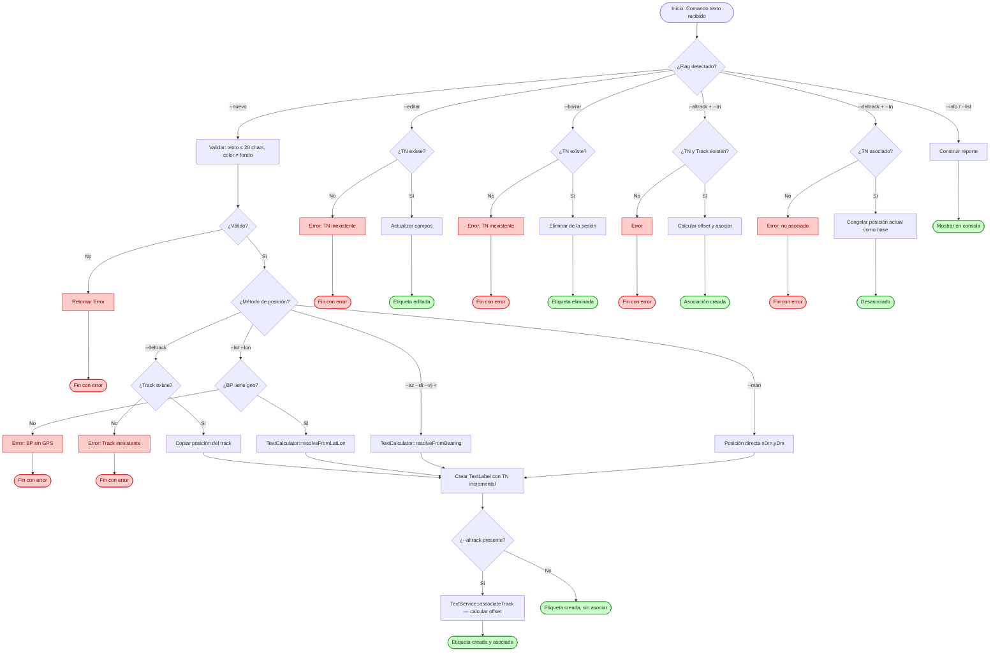
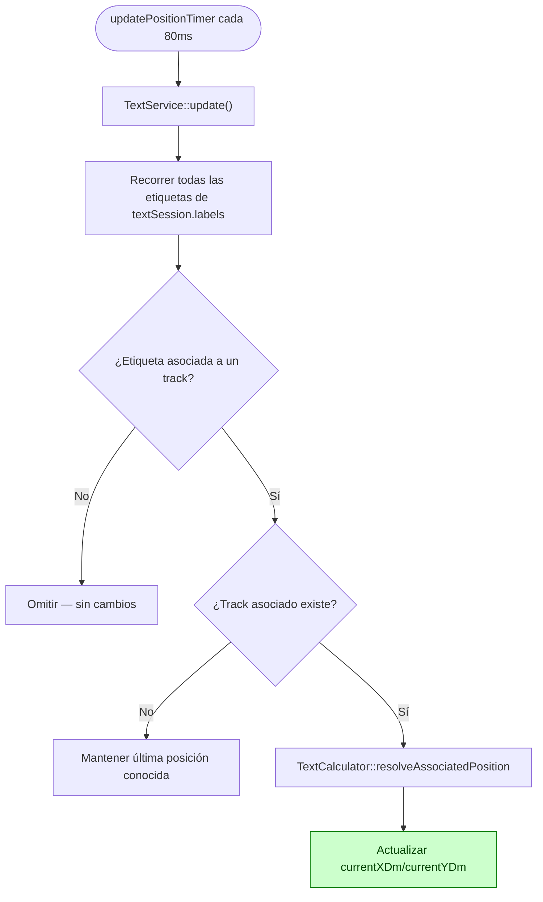

# Flujo: Módulo Texto

## Descripción general

Este flujo documenta la gestión de etiquetas de anotación libre sobre la pantalla del radar LPD. Cada etiqueta combina un texto (hasta 20 caracteres), un formato visual configurable (tamaño, color de fuente, borde y fondo) y una posición sobre el plano táctico.

A diferencia de los módulos 2W y Hombre al Agua, Texto no tiene componente cinemático propio ni límite máximo de instancias simultáneas — el operador es responsable de gestionar la cantidad de anotaciones en pantalla según su criterio operativo.

Una etiqueta puede permanecer estática en el punto donde fue creada, o asociarse dinámicamente a un track del radar para acompañar su movimiento, manteniendo un desplazamiento (offset) fijo respecto a él.

---

## Lista de archivos y clases

| Archivo | Clase/Struct | Responsabilidad |
|---|---|---|
| `src/controller/commands/textCommand.cpp` | `TextCommand` | Entrada CLI para pruebas manuales: crear, editar, borrar, asociar/desasociar, consultar. |
| `src/controller/services/textService.cpp` | `TextService` | Orquestador del ciclo de vida completo de las etiquetas e integrador con el bucle de actualización. |
| `src/model/texto/textCalculator.cpp` | `TextCalculator` | Motor matemático puro: resuelve posición inicial (Sección B) y recálculo dinámico (Sección C). |
| `src/model/texto/textLabel.h` | `TextLabel` | Entidad de datos de una etiqueta individual — contenido, formato, posición y asociación. |
| `src/model/texto/textSessionState.h` | `TextSessionState` | Contenedor de sesión — lista dinámica de `TextLabel`, sin límite fijo. |
| `src/model/commandContext.h` | `CommandContext` | Contenedor global que aloja `textSession` dentro del pipeline del sistema. |

---

## Clases principales

### TextCommand

- **Rol**: Wrapper CLI para pruebas manuales. El camino real del operador es exclusivamente gráfico (botonera) — este comando existe solo para testing y verificación durante el desarrollo.
- **Comandos soportados**:

| Comando | Descripción |
|---|---|
| `texto --nuevo --texto=<str> --tamano=<xs\|md\|lg> --color=<c> [--borde=<c>] [--fondo=<c>] (--man=<x>,<y> \| --az=<g> --dt=<dm> (--v\|--r) \| --lat=<g>,<m>,<s> --lon=<g>,<m>,<s> \| --deltrack=<tn>) [--altrack=<tn>]` | Crea una etiqueta nueva. |
| `texto --editar=<tn> [--texto=<str>]` | Edita una etiqueta existente. |
| `texto --borrar=<tn>` | Elimina una etiqueta. |
| `texto --altrack=<trackId> --tn=<tn>` | Asocia una etiqueta existente a un track. |
| `texto --deltrack --tn=<tn>` | Desasocia una etiqueta de su track. |
| `texto --info=<tn>` | Muestra el detalle completo de una etiqueta. |
| `texto --list` | Lista todas las etiquetas activas. |

- **Reglas de validación CLI**:
  - `--texto` no puede superar los 20 caracteres.
  - Los cuatro métodos de posición (`--man`, `--az`/`--dt`, `--lat`/`--lon`, `--deltrack`) son mutuamente excluyentes — solo uno por etiqueta.
  - `--az` requiere `--dt` y exactamente uno de `--v` (Verdadero) o `--r` (Relativo).
  - `--lat`/`--lon` se ingresan en formato GMS (`grados,minutos,segundos`) y se convierten con `RadarMath::dmsToDecimal`.

### TextService

- **Rol**: Coordinador del ciclo de vida completo de las etiquetas. No tiene límite de instancias — genera un TN incremental por cada etiqueta nueva.
- **Métodos clave**:

| Método | Firma | Descripción |
|---|---|---|
| Crear | `TextOperationResult createLabel(const TextCreateParams& params)` | Valida y resuelve la posición según el método de la Sección B, crea el `TextLabel` y lo agrega a la sesión. |
| Editar | `TextOperationResult editLabel(int tn, const QMap<QString, QString>& fields)` | Modifica campos de una etiqueta existente. |
| Borrar | `TextOperationResult deleteLabel(int tn)` | Elimina una etiqueta de la sesión. |
| Asociar | `TextOperationResult associateTrack(int textTn, int trackId)` | Asocia una etiqueta a un track, calculando el offset fijo. |
| Desasociar | `TextOperationResult dissociateTrack(int textTn)` | Desasocia una etiqueta, congelando su posición actual como nueva base. |
| Listar | `TextOperationResult listLabels() const` | Devuelve un resumen de todas las etiquetas activas. |
| Consultar | `TextOperationResult infoLabel(int tn) const` | Devuelve el detalle completo de una etiqueta. |
| Actualización | `void update()` | Recorre las etiquetas asociadas y recalcula su posición cada 80ms. |

### TextCalculator

- **Rol**: Motor de cómputo puro. Resuelve dos problemas matemáticos independientes: la proyección inicial de posición (Sección B, una sola vez al crear) y el recálculo de posición asociada (Sección C, cada ciclo).
- **Métodos clave**:

| Método | Firma | Descripción |
|---|---|---|
| AZ/DT | `static QPointF resolveFromBearing(QPointF referencePos, double azimuthDeg, double distanceDm, bool useVerdadero, double ownCourseDeg)` | Proyecta una coordenada desde una posición de referencia, en modo Verdadero o Relativo a la proa. |
| LAT/LON | `static QPointF resolveFromLatLon(double originLat, double originLon, double targetLat, double targetLon)` | Convierte lat/lon absoluta a DM usando el origen geográfico del BP. |
| Asociación | `static QPointF resolveAssociatedPosition(QPointF trackPos, double offsetXDm, double offsetYDm)` | Calcula la posición actual de una etiqueta asociada, sumando el offset a la posición instantánea del track. |

- **Consideraciones técnicas del motor**:
  - **AZ/DT Relativo (R)**: se le suma el rumbo actual del Buque Propio al azimut ingresado antes de proyectar, para obtener el azimut verdadero equivalente.
  - **LAT/LON**: reutiliza `RadarMath::latLonToDm()`, el mismo mecanismo del disparador 3 de Hombre al Agua. Requiere que el BP tenga coordenadas geográficas reales.
  - **DEL TRACK**: no involucra trigonometría — es una copia puntual de la posición actual del track de referencia.
  - **Asociación dinámica**: el offset se calcula una única vez al momento de asociar (`offset = posiciónEtiqueta - posiciónTrack`), y se mantiene fijo mientras dure la asociación.

---

## Flujo de datos (Ciclo de Vida del Comando)



### Flujo CLI (Paso a Paso)

El usuario ejecuta el comando en la consola utilizando cualquiera de las siguientes sintaxis:

```bash
texto --nuevo --texto="AREA MIRAMAR" --tamano=lg --color=rojo --borde=blanco --fondo=azul --man=50,30
texto --nuevo --texto="ZONA NORTE" --tamano=md --color=verde --az=90 --dt=20 --v
texto --nuevo --texto="PUERTO BB" --tamano=md --color=cian --lat=-34,30,0 --lon=-58,20,0
texto --nuevo --texto="JUNTO A F1" --tamano=md --color=purpura --deltrack=1
texto --altrack=1 --tn=5
texto --deltrack --tn=5
texto --editar=1 --texto="NUEVO NOMBRE"
texto --borrar=1
texto --info=1
texto --list
```

1. `TextCommand::execute` intercepta los argumentos y determina cuál de los modos fue invocado.
2. Para `--nuevo`, se valida que exactamente uno de los cuatro métodos de posición esté presente, y que el color de fuente no coincida con el color de fondo.
3. Si las validaciones fallan, el comando interrumpe la ejecución y retorna un `CommandResult` con estado `false`.
4. Si los parámetros son correctos, se invoca el método correspondiente de `TextService`, que resuelve la posición (delegando a `TextCalculator` cuando corresponde) y crea o modifica el `TextLabel`.

---

### Ciclo de Recálculo Continuo (Bucle Activo)

Al igual que 2W y Hombre al Agua, el módulo Texto se evalúa de manera continua mediante el temporizador asincrónico de `main.cpp`, aunque solo afecta a las etiquetas con asociación activa:



---

## Estructuras de Datos Clave

### Entidad de Etiqueta (`TextLabel`)

- **Identidad**: `tn` (Track Number propio, incremental).
- **Sección A — contenido y formato**: `texto`, `fontSize`, `fontColor`, `borderColor`, `backgroundColor`.
- **Sección B — posición base**: `positionMethod`, `baseXDm`, `baseYDm` (fijados al crear, no cambian).
- **Sección C — asociación**: `associated`, `associatedTrackId`, `offsetXDm`, `offsetYDm`.
- **Posición actual**: `currentXDm`, `currentYDm` (recalculada cada ciclo si está asociada).

### Contenedor de Sesión (`TextSessionState`)

- **Lista dinámica**: `QList<TextLabel> labels` — sin límite máximo de instancias.
- **Contador**: `nextTn` — asigna el TN incremental a cada etiqueta nueva.

> A diferencia de `HaSessionState` (array fijo de 10 slots), `TextSessionState` usa una lista dinámica. Se confirmó con el equipo que no existe límite máximo de etiquetas simultáneas — el operador es responsable de gestionar la cantidad en pantalla.

---

## Convención de Colores (Paleta)

| Color | Uso típico |
|---|---|
| Rojo | Texto / Borde / Fondo |
| Verde | Texto / Borde / Fondo |
| Azul | Texto / Borde / Fondo |
| Cian | Texto / Borde / Fondo |
| Magenta | Texto / Borde / Fondo |
| Amarillo | Texto / Borde / Fondo |
| Blanco | Texto / Borde / Fondo |
| Púrpura | Texto / Borde / Fondo |
| Marrón-anaranjado | Texto / Borde / Fondo |

---

## Manejo de Errores y Casos de Borde

- **Falta de contraste**: si el color de fuente coincide con el color de fondo, la creación se rechaza antes de fijar la etiqueta.
- **LAT/LON sin georeferenciación**: igual que el disparador 3 de HA, requiere que el Buque Propio tenga coordenadas geográficas reales. Sin ese dato, la operación se rechaza con un mensaje explícito.
- **Track de referencia inexistente**: si `--deltrack` o `--altrack` referencian un track que no existe, la operación se rechaza sin crear ni modificar la etiqueta.
- **Track asociado eliminado**: si el track asociado desaparece del sistema mientras la asociación está activa, la etiqueta **no se desasocia automáticamente** — permanece congelada en su última posición conocida. *(Pendiente de confirmación formal con el equipo — evaluar si el comportamiento esperado es la desasociación automática.)*
- **Longitud de texto**: se valida que no supere los 20 caracteres tanto en creación como en edición.

---

## Módulos Relacionados

- `src/model/commandContext.h` — Estructura general de ejecución.
- `src/model/utils/RadarMath.h` — Conversión de unidades y coordenadas reutilizadas (`latLonToDm`, `dmsToDecimal`, `normalizeAngle360`).
- `docs/modules/hombre-al-agua.md` — Origen del mecanismo de conversión LAT/LON y georeferenciación del BP.
- `docs/modules/2w.md` — Pipeline homólogo de arquitectura en capas.
