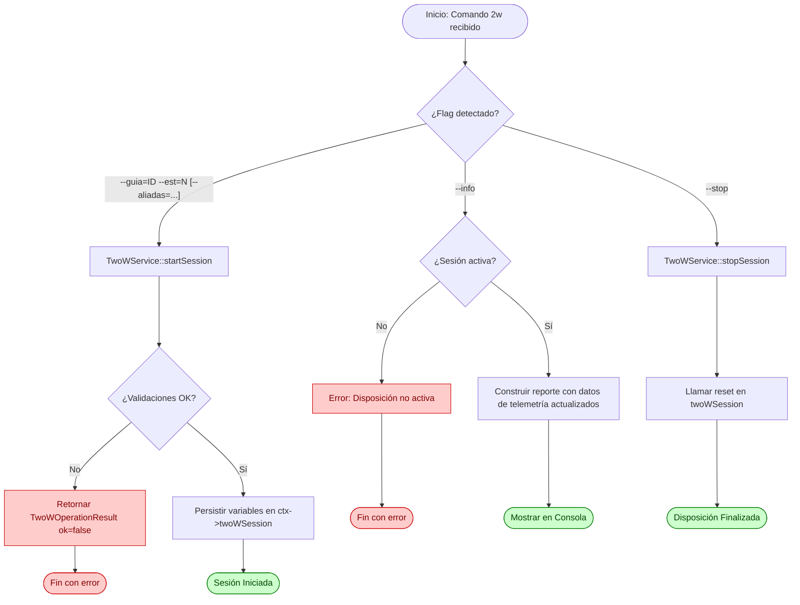

# Flujo: Formación 2W

## Descripción general

Este flujo documenta la gestión y el cálculo cinemático continuo de la **Disposición de Formación Táctica 2W** para el Buque Propio (`ownShip`) y fuerzas aliadas respecto a un buque designado como Guía (`guideTrack`). 

A partir de una estación asignada (basada en los casilleros del 1 al 68 de la Tabla A) y un factor de escala por radio, el sistema proyecta la posición teórica que debería ocupar el buque, evalúa la discrepancia táctica en tiempo real (desvío en azimut y distancia) y calcula el rumbo recomendado de intercepción directa junto con su tiempo estimado de arribo (ETA) en minutos.

---

## Lista de archivos y clases

| Archivo | Clase/Struct | Responsabilidad |
|---|---|---|
| `src/controller/commands/TwoWCommand.cpp` | `TwoWCommand` | Entrada CLI para iniciar (`--guia`, `--est`, `--aliadas`), detener (`--stop`) y consultar (`--info`) la formación. |
| `src/controller/services/TwoWService.cpp` | `TwoWService` | Orquestador del ciclo de vida de la sesión (start/stop) e integrador con el bucle de actualización. |
| `src/model/2w/twoWCalculator.cpp` | `TwoWCalculator` | Motor matemático puro encargado de proyectar las estaciones y resolver la cinemática de intercepción. |
| `src/model/2w/twoWSessionState.h` | `TwoWSessionState` | Estructura de datos que persiste el estado dinámico y los resultados analizados de la formación. |
| `src/model/2w/twoWStationTable.h` | `TwoWStationTable`, `TwoWStationEntry` | Matriz estática indexada que encapsula la geometría base de las 68 estaciones de la Tabla A. |
| `src/model/commandContext.h` | `CommandContext` | Contenedor global que aloja la sesión activa `twoWSession` dentro del pipeline del sistema. |

---

## Clases principales

### TwoWCommand

- **Rol**: Wrapper CLI encargado exclusivamente del análisis sintáctico de tokens. No contiene reglas de negocio: delega toda validación y ejecución a `TwoWService`, devolviendo directamente el `TwoWOperationResult` recibido.

- **Métodos clave**:

| Método | Firma | Descripción |
|---|---|---|
| Ejecutar | `CommandResult execute(const CommandInvocation& inv, CommandContext& ctx) const` | Modula entre los modos operativos (`--info`, `--stop`, o inicialización de sesión). |

- **Validación en CLI**: limitada a la conversión de tipos primitivos (`toInt`, `toDouble`) y a la presencia de parámetros obligatorios (`--guia` y `--est`). Las reglas de negocio (rangos, estaciones en tabla, radio positivo, estaciones aliadas) se resuelven en `TwoWService`.

### TwoWService

- **Rol**: Interfaz de control operativo que centraliza las reglas de validación de negocio (rangos numéricos, existencia de estaciones en la Tabla A, validez del radio, rango y presencia de estaciones aliadas), manipula el estado de la sesión táctica y actúa como puente hacia el calculador. Todos los métodos públicos de operación devuelven una estructura uniforme `TwoWOperationResult { bool ok; QString message; }`.

- **Métodos clave**:

| Método | Firma | Descripción |
|---|---|---|
| Iniciar Sesión | `TwoWOperationResult startSession(int guideTrackId, int bpStation, double circleRadiusNm, const QList<int>& aliadas = {})` | Valida rangos, presencia en tabla y radio, luego fija el buque guía, la estación del Buque Propio, el radio y las estaciones aliadas en el contexto. |
| Finalizar Sesión | `TwoWOperationResult stopSession()` | Valida que haya sesión activa y llama al método `reset()` de la estructura de datos. |
| Actualización | `void update()` | Extrae las posiciones cinemáticas actuales de los vectores globales e invoca el recálculo geométrico. |

### TwoWCalculator

- **Rol**: Motor de cómputo plano que realiza las transformaciones de coordenadas y proyecciones trigonométricas relativas al Guía.
- **Métodos clave**:

| Método | Firma | Descripción |
|---|---|---|
| Calcular | `static void calculate(...)` | Proyecta el centro de la estación asignada al Buque Propio y aliados, calculando desvíos, rumbo directo y ETA. |

- **Consideraciones técnicas del motor**:
  - **Conversión de unidades**: Mapea distancias utilizando el factor constante $1\text{ NM} = 185.2\text{ Decámetros (DM)}$ para unificar criterios con el plano cartesiano del radar.

---

## Flujo de datos (Ciclo de Vida del Comando)



  ### Flujo CLI (Paso a Paso)

El usuario ejecuta el comando en la consola utilizando la sintaxis de inicialización:

```bash
2w --guia=<trackId> --est=<estacion> [--radio=<mn>] [--aliadas=<est1,est2,...>]
```

1. `TwoWCommand::execute` intercepta los argumentos y los procesa en un mapa local de opciones (`QMap<QString, QString> opts`), normalizando las claves a minúsculas y removiendo los guiones iniciales (`--`).
2. El comando realiza únicamente validaciones de forma: verifica la presencia obligatoria de `--guia` y `--est`, y que los valores puedan convertirse a tipos primitivos (`toInt`, `toDouble`). Las reglas de negocio se delegan al servicio.
3. Se invoca `TwoWService::startSession()`, que valida internamente rangos, presencia en tabla, radio positivo y estaciones aliadas. Si alguna falla, devuelve un `TwoWOperationResult` con `ok=false` y el mensaje correspondiente, que el comando traduce directamente a `CommandResult`.
---

### Ciclo de Recálculo Continuo (Bucle Activo)

A diferencia de otros comandos puntuales, la formación se evalúa de manera continua en el bucle principal de la aplicación (`main.cpp`) mediante un temporizador asincrónico:


---

## Estructuras de Datos Clave

### Estructura de la Tabla A (`TwoWStationEntry`)

La matriz estática posee la siguiente composición geométrica rígida para modelar las estaciones:

- **`azimuthDeg`**: Ángulo verdadero en grados `[0, 360)` tomado desde el Guía (origen de la cuadrícula).
- **`distanceNm`**: Distancia radial calculada con un radio base equivalente a `1 NM`.

### Estado de Sesión (`TwoWSessionState`)

Mantiene la separación limpia entre parámetros de configuración y métricas dinámicas listas para el frontend:

- **Datos de control**: `active`, `guideTrackId`, `bpStation`, `circleRadiusNm`, `selectedStations`.
- **Centros cartesianos**: `guideCircleCenter` (Verde), `ownCircleCenter` (Azul), `allyCircleCenters` (Ámbar).
- **Telemetría calculada**: `courseToStationDeg`, `timeToStationMin`, `currentAzimuthDeg`, `currentDistanceNm`, `expectedAzimuthDeg`, `expectedDistanceNm`.

---

## Manejo de Errores y Casos de Borde

- **Validación de rangos numéricos**: `TwoWService` rechaza estaciones del BP o aliadas fuera del intervalo `[1, 68]` o no presentes en la Tabla A (marcadas con `distanceNm = -1.0`). `TwoWCommand` ya no contiene estas validaciones.
- **Tratamiento de indeterminaciones cinemáticas**: Si la velocidad del Buque Propio es exactamente `0.0`, el sistema deshabilita de manera segura el indicador `kinematicsValid` para saltarse el cálculo del ETA y evitar la división por cero en la ecuación temporal.
- **Pérdida crítica de referencia**: Si el buque designado como Guía es eliminado de la lista global de vectores tácticos (`findTrackById(s.guideTrackId)` devuelve `nullptr`), el servicio intercepta la anomalía en el siguiente ciclo de `80 ms` y fuerza un `stopSession()` inmediato para proteger la integridad del sistema.

---

## Módulos Relacionados

- `src/model/commandContext.h` — Estructura general de ejecución.
- `docs/modules/estacionamiento.md` — Pipeline homólogo de maniobras relativas.